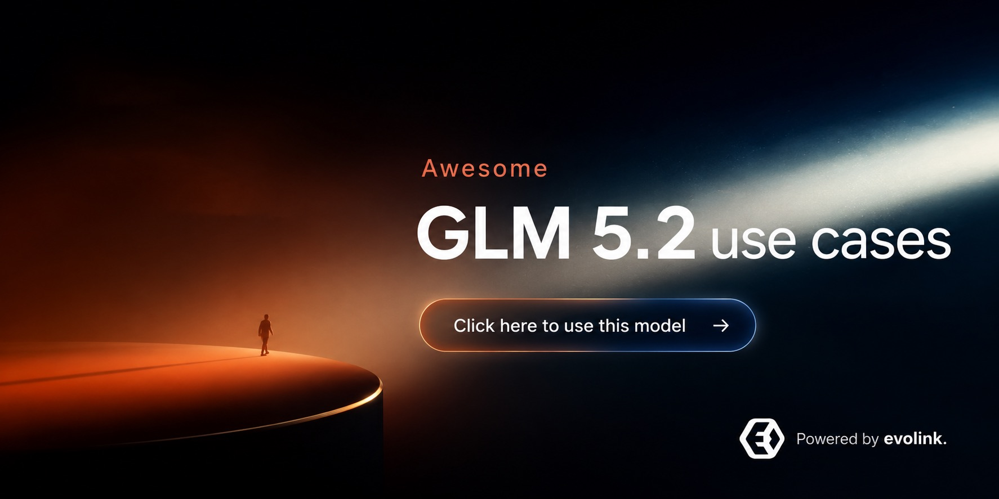

<div align="center">

<a href="https://evolink.ai/glm-5-2?utm_source=github&utm_medium=banner&utm_campaign=awesome-glm-5.2-usecases"></a>

[](LICENSE)
[](https://evolink.ai/glm-5-2?utm_source=github&utm_medium=badge&utm_campaign=awesome-glm-5.2-usecases)
[](https://evolink.ai/glm-5-2?utm_source=github&utm_medium=badge&utm_campaign=awesome-glm-5.2-usecases)
[](https://docs.evolink.ai?utm_source=github&utm_medium=readme&utm_campaign=awesome-glm-5.2-usecases)

[](README.md)
[](README_es.md)
[](README_pt.md)
[](README_ja.md)
[](README_ko.md)
[](README_de.md)
[](README_fr.md)
[](README_tr.md)
[](README_zh-TW.md)
[](README_zh-CN.md)
[](README_ru.md)

</div>

# Repositório de use cases GLM-5.2

## 🍌 Introdução

Bem-vindo ao repositório de casos de uso de alta relevância do GLM-5.2.

**Reunimos casos reais, tutoriais, integrações, avaliações, sinais de preço e limitações do GLM-5.2 a partir de demos públicas e comunidades de criadores.**

Este README localizado foca casos com workflows concretos, evidência pública de benchmarks, demos práticas, integrações, custos ou ressalvas úteis.

Cada título de caso aponta para a fonte pública, e cada autor aponta para o perfil do criador.

[Testar GLM-5.2 no Evolink](https://evolink.ai/glm-5-2?utm_source=github&utm_medium=readme&utm_campaign=awesome-glm-5.2-usecases)

## 📊 Visão Geral

- **140 casos selecionados de GLM-5.2** de criadores públicos, equipes de benchmark, desenvolvedores de ferramentas, provedores e usuários práticos.
- Cobre avaliações comparativas e avaliação de fronteira, agentes de código e fluxos de trabalho de contexto longo, demos práticas e mostras, integrações de provedores e ferramentas, custo, preços e implantação local, limites, ressalvas e sinais de segurança.
- Cada caso inclui a fonte original, a atribuição do criador, um takeaway de uso conciso, o tipo de evidência e a data de publicação.
- Use este repo para encontrar workflows práticos, comparar pontos fortes e limites, descobrir provedores e acompanhar experimentos reais.

> [!NOTE]
> A coleção favorece evidência concreta em vez de hype: demos lançadas, métodos de benchmark, notas de integração, dados de custo e ressalvas explícitas.

> [!NOTE]
> Os READMEs localizados preservam a mesma ordem de casos, links, anchors e atribuição da fonte em inglês. Alguns títulos permanecem próximos ao idioma original para manter rastreabilidade.

<a id="-quick-api-access"></a>
## ⚡ Acesso rápido à API

Use o GLM-5.2 pela API Chat Completions compatível com OpenAI da Evolink. Obtenha uma API key na [Evolink](https://evolink.ai/glm-5-2?utm_source=github&utm_medium=readme&utm_campaign=awesome-glm-5.2-usecases) e defina-a como `EVOLINK_API_KEY` antes de executar a chamada.

```bash
export EVOLINK_API_KEY="your_api_key_here"

curl --request POST \
  --url https://direct.evolink.ai/v1/chat/completions \
  --header "Authorization: Bearer ${EVOLINK_API_KEY}" \
  --header 'Content-Type: application/json' \
  --data '{
    "model": "glm-5.2",
    "messages": [
      {
        "role": "user",
        "content": "Please introduce yourself"
      }
    ]
  }'
```

Leia a referência completa da API GLM-5.2: [Abrir docs da API GLM-5.2](https://docs.evolink.ai/en/api-manual/language-series/glm-5.2/glm-5.2-api).

## 📑 Menu

| Seção | Casos |
|---|---|
| [📏 Avaliações comparativas e avaliação de fronteira](#benchmarks-frontier-evaluation) | Caso 1-12, 60, 70, 72, 76, 90, 94, 110-111, 113, 120-121 |
| [💻 Agentes de código e fluxos de trabalho de contexto longo](#coding-agents-long-context-workflows) | Caso 13-22, 62, 65, 66, 77, 80, 91, 102, 117, 119, 122, 127, 135-136 |
| [🎮 Demos práticas e mostras](#hands-on-demos-showcase-builds) | Caso 23-30, 71, 78, 81-82, 92, 99-100, 123 |
| [🔌 Integrações de provedores e ferramentas](#provider-tool-integrations) | Caso 31-42, 61, 63, 69, 74, 79, 83-87, 93, 95-96, 101, 104-105, 109, 115-116, 124-125, 128-130, 137 |
| [💸 Custo, preços e implantação local](#cost-pricing-local-deployment) | Caso 43-51, 64, 68, 88-89, 97-98, 106-107, 112, 118, 131, 138-140 |
| [🧭 Limites, ressalvas e sinais de segurança](#limits-caveats-safety-signals) | Caso 52-59, 67, 73, 75, 103, 108, 114, 126, 132-134 |
| [🙏 Agradecimentos](#acknowledge) | Créditos e política de correções |

### [📏 Avaliações comparativas e avaliação de fronteira](#benchmarks-frontier-evaluation)

| Caso | Foco | Tipo |
|---|---|---|
| [Case 120: PostTrainBench Reliability Lead](#case-120) | Use este caso para comparar o GLM-5.2 Max em confiabilidade de agentes pós-treinamento, não só pela pontuação principal, porque a tabela também registra zero execuções falhas em 84 tarefas. | Benchmark |
| [Case 121: Fireworks + Faros 211-Task Repo Eval](#case-121) | Use este caso para julgar o GLM-5.2 em tarefas reais de engenharia em repositórios privados, em vez de depender apenas de benchmarks públicos, porque o resultado publicado inclui nota, velocidade e custo por tarefa. | Evaluation |
| [Case 110: AA-Briefcase Time-Per-Task Frontier](#case-110) | Use este caso para comparar o GLM-5.2 em tarefas de conhecimento de longo horizonte em que o tempo por tarefa importa junto com a pontuação de benchmark. | Benchmark |
| [Case 111: Code Arena Frontend Head-to-Head Margins](#case-111) | Use este caso para inspecionar a vantagem do GLM-5.2 em frontend por resultados pareados cara a cara, em vez de depender de uma única captura de ranking. | Benchmark |
| [Case 113: SWE Atlas Codebase QnA Runner-Up](#case-113) | Use este caso para acompanhar o GLM-5.2 em Codebase QnA, escrita de testes e refatoração, em vez de olhar apenas rankings SWE de tarefa única. | Benchmark |
| [Artificial Analysis Intelligence Index](#case-1) | Use a postagem de Análise Artificial para comparar o GLM-5.2 com outros modelos de fronteira proprietários e de peso aberto em inteligência e custo por tarefa. | Referência |
| [Code Arena Frontend Ranking](#case-2) | Use este caso para avaliar o GLM-5.2 em tarefas reais de codificação de front-end avaliadas por comparações no estilo arena. | Referência |
| [Design Arena First Place](#case-3) | Use este caso para julgar se o GLM-5.2 pode lidar com tarefas de design mais código em vez de apenas benchmarks de codificação com muito texto. | Referência |
| [FrontierSWE Result](#case-4) | Use a postagem FrontierSWE para comparar o GLM-5.2 com os modelos GPT-5.5, Opus e estilo Fable em tarefas de engenharia de software. | Referência |
| [DeepSWE Open-Source Lead](#case-5) | Use o caso DeepSWE para entender o GLM-5.2 como um modelo aberto forte para tarefas difíceis de avaliação de engenharia de software. | Referência |
| [Terminal-Bench Over 80 Percent](#case-6) | Use este caso ao avaliar o GLM-5.2 para codificação orientada a terminal e fluxos de trabalho de agente. | Referência |
| [Comparação do SWELancer com GPT-5.5](#case-7) | Use este caso SWELancer como uma comparação multimétrica concreta entre GLM-5.2 e GPT-5.5 sobre sucesso de tarefa, recompensa e tempo de conclusão. | Avaliação |
| [BridgeBench Perfect Score Signal](#case-8) | Use este caso para inspecionar o GLM-5.2 com base no raciocínio fundamentado em várias etapas, em vez de apenas codificar tabelas de classificação. | Referência |
| [BridgeBench Reasoning Number One](#case-9) | Use este caso para comparar o GLM-5.2 com modelos de fronteira fechada em tarefas de raciocínio fundamentado. | Referência |
| [KernelBench-Hard Without Shortcutting](#case-10) | Use este caso ao verificar se os ganhos de benchmark provêm de um comportamento de implementação válido em vez de atalhos. | Avaliação |
| [Runescape Bench Catch-Up](#case-11) | Use este caso como um sinal rápido para o progresso do modelo de peso aberto em tarefas de benchmark semelhantes a jogos. | Referência |
| [BridgeBench Speed Improvement](#case-12) | Use este caso para avaliar fluxos de trabalho sensíveis à latência, onde a velocidade é importante junto com a inteligência. | Referência |
| [Codificação KernelBench Hard e Mega GPU](#case-60) | Use este caso para avaliar o GLM-5.2 na codificação do kernel da GPU em KernelBench-Hard e KernelBench-Mega, onde os rastreamentos de agente aberto tornam o resultado inspecionável. | Referência |
| [Liderança open-source no DeepSWE em esforço máximo](#case-70) | Use este caso para acompanhar o GLM-5.2 no DeepSWE em esforço máximo, onde o leaderboard publicado o coloca em primeiro entre os modelos abertos com 44% de pass@1. | Referência |
| [Vice-campeão em benchmark de debate LLM](#case-72) | Use este caso para avaliar o GLM-5.2 além de tarefas de código em debates adversariais multi-turno, onde a variante de raciocínio máximo ficou em segundo atrás dos modelos Claude. | Referência |
| [Taxa de alucinação no AA-Omniscience](#case-76) | Use este caso para comparar o GLM-5.2 em tratamento de incerteza, onde o resultado publicado do AA-Omniscience mostra taxa de alucinação menor que a de vários outros modelos frontier. | Avaliação |
| [Case 90: GDPval-AA Agentic Work Index](#case-90) | Use este caso para comparar o GLM-5.2 em trabalho de conhecimento de longo horizonte, em vez de rankings focados apenas em código. | Avaliação |
| [Case 94: Game Dev Arena Runner-Up](#case-94) | Use este caso para julgar a qualidade do GLM-5.2 em criação de jogos, em que o modelo chegou ao segundo lugar no Game Dev Arena e se tornou o laboratório open-weight mais bem colocado nesse ranking. | Avaliação |

### [💻 Agentes de código e fluxos de trabalho de contexto longo](#coding-agents-long-context-workflows)

| Caso | Foco | Tipo |
|---|---|---|
| [Case 136: Cursor + Fireworks 455M-Token Field Test](#case-136) | Use este caso para julgar o GLM-5.2 como um modelo diário sério no Cursor, porque o autor relata 455M tokens de uso real com serving rápido da Fireworks e nenhuma vontade imediata de voltar para Opus ou GPT-5.5. | Evaluation |
| [Case 135: Devin Desktop Harness With Skill Portability](#case-135) | Use este caso para testar o GLM-5.2 dentro do Devin Desktop quando a própria superfície de coding da Z.ai parecer instável, porque o autor relata portabilidade mais fácil de skills, maior velocidade e melhor hackeabilidade ali. | Evaluation |
| [Case 127: Pi Inline GLM Reviewer](#case-127) | Use este caso para adicionar um segundo revisor a um loop de agente de código estilo Pi, porque o autor relata que o GLM-5.2 pode aconselhar o Opus turno a turno com um aumento de custo de cerca de 10%. | Integration |
| [Case 122: One-Shot Telegram Bot With AgentRouter](#case-122) | Use este caso para testar se o GLM-5.2 consegue inferir defaults com mentalidade de produção em uma build one-shot com agente de código, em vez de gerar apenas o caminho mínimo que funciona. | Demo |
| [Case 117: OpenCode Go Refactor First-Pass Win](#case-117) | Use este caso para avaliar o GLM-5.2 em refatorações médias de Go dentro do OpenCode, em vez de se apoiar apenas em alegações de benchmark. | Evaluation |
| [Case 119: Claude Code + Cursor $3.36 Default Run](#case-119) | Use este caso para medir o GLM-5.2 como modelo diário no Claude Code e no Cursor antes de mover mais trabalho autônomo de programação para pesos abertos. | Evaluation |
| [One Hour Forty Two Minute Refactor Loop](#case-13) | Use este caso como um padrão para refatoração de front-end autônoma longa com TDD, feedback do revisor e verificações de regressão. | Demonstração |
| [OpenCode Bug Fix And Implementation Test](#case-14) | Use este caso para testar o GLM-5.2 como um agente de codificação OpenCode para correções de bugs, além de uma pequena tarefa de implementação. | Demonstração |
| [OpenCode Retro Video Game Walkthrough](#case-15) | Use este passo a passo para criar um pequeno jogo com GLM-5.2 e OpenCode a partir de um único prompt e, em seguida, inspecione como o modelo lida com os detalhes de implementação. | Tutorial |
| [HTML5 Physics Simulations Contest](#case-16) | Use este caso para comparar o código GLM-5.2 e Kimi K2.7 em simulações de física HTML5 independentes sem bibliotecas. | Avaliação |
| [Personal Site UI UX Build](#case-17) | Use este caso para solicitar ao GLM-5.2 um site pessoal sofisticado e inspecionar até que ponto várias voltas podem melhorar a UI/UX. | Demonstração |
| [AI Contract Review Product Build](#case-18) | Use este caso para avaliar o GLM-5.2 em uma tarefa de construção de produto com PRD, orçamento de tempo, contagem de etapas, cota de uso e comparação de qualidade de código. | Avaliação |
| [ZCode Goal Feature For Larger Development Objectives](#case-19) | Use este caso para entender como o GLM-5.2 é integrado ao ZCode 3.0 para tarefas maiores de desenvolvimento de agentes. | Integração |
| [Linux Wrapper para ZCode construído com GLM-5.2](#case-20) | Use este caso como um exemplo de assistência do GLM-5.2 com ferramentas em ambientes de agente de codificação. | Demonstração |
| [Computer Use Skill Packaging](#case-21) | Use este caso para estudar o GLM-5.2 como um auxiliar para transformar um repositório de uso de computador de código aberto em uma habilidade reutilizável. | Demonstração |
| [ZCode 3.0 Agentic Development Environment Review](#case-22) | Use este caso para avaliar o GLM-5.2 dentro de um ambiente de desenvolvimento de agente completo, em vez de uma única sessão de chat. | Demonstração |
| [Chicote OpenCode com veiculação local](#case-62) | Use este caso para testar o GLM-5.2 com o chicote OpenCode, serviço local e fluxos de trabalho de codificação com muitas ferramentas antes de compará-lo com Claude Opus. | Avaliação |
| [Fast-RLM Long-Context Instruction Injection](#case-65) | Use este caso para melhorar a contagem de contexto longo do GLM-5.2 e o comportamento do agente REPL movendo instruções para o prompt do sistema RLM. | Integração |
| [DeepAgents Code Open Harness Trial](#case-66) | Use este caso para testar o GLM-5.2 com um chicote de agente de codificação aberto e compare o modelo em um shell de agente reproduzível. | Demonstração |
| [Roteamento de stack de agentes de marketing em produção](#case-77) | Use este caso para rotear o GLM-5.2 para workflows de agentes em produção que valorizam estrutura, velocidade e self-hosting, mantendo modelos fechados mais fortes para julgamentos ambíguos. | Avaliação |
| [Case 91: Cline Repo Bug Fix Showdown](#case-91) | Use este caso para comparar GLM-5.2 e Opus 4.8 em uma correção de bug de repositório real, em que o GLM gastou mais tokens, mas entregou o patch final mais barato e mais limpo. | Avaliação |
| [Case 102: OpenInspect FP8 Background Agent](#case-102) | Use este caso para estudar uma pilha de agente em segundo plano auto-hospedada com GLM-5.2 em vez de um workflow de chat hospedado. | Integração |

### [🎮 Demos práticas e mostras](#hands-on-demos-showcase-builds)

| Caso | Foco | Tipo |
|---|---|---|
| [Case 123: Recast Six-Variation Landing-Page Loop](#case-123) | Use este caso para prototipar landing pages com baixo custo gerando várias variantes com GLM-5.2 primeiro e levando depois a melhor para um agente de código. | Tutorial |
| [Playable Backrooms One-Shot](#case-23) | Use este caso para comparar a saída, o tempo de execução e o custo da construção de jogos no mesmo prompt entre o GLM-5.2 e o Opus 4.8. | Demonstração |
| [Três construções reais com resultados mistos](#case-24) | Use este caso como um conjunto de demonstração de advertência: teste várias compilações reais antes de confiar em um modelo para jogos de produção ou tarefas de vídeo. | Avaliação |
| [Super Mario Clone In ZCode](#case-25) | Use este caso para avaliar a construção iterativa de jogos com GLM-5.2 e ZCode em várias passagens de correção e recursos. | Demonstração |
| [Lunar Lander Contest](#case-26) | Use este caso para comparar GLM-5.2, MiniMax M3 e Kimi K2.7 Code em uma tarefa interativa de estilo de jogo. | Avaliação |
| [One-Prompt Design Arena Creation](#case-27) | Use este caso para inspecionar o que o GLM-5.2 pode gerar a partir de um único prompt de design em um contexto de arena. | Demonstração |
| [Artigo de pesquisa Compreendendo o fluxo de trabalho](#case-28) | Use este caso para aplicar o GLM-5.2 a fluxos de trabalho de leitura de artigos com perguntas contextuais e referências entre artigos. | Integração |
| [Constrained Poem Comparison](#case-29) | Use este caso para separar a correção da qualidade criativa ao comparar o GLM-5.2 com modelos no estilo Fable. | Avaliação |
| [Design Sense Example](#case-30) | Use este caso como um sinal de design visual leve e, em seguida, verifique com seu próprio prompt e revisão da IU. | Demonstração |
| [Jogo voxel estilo Temple Run em one-shot](#case-71) | Use este caso para estressar o GLM-5.2 em geração de jogos com um único prompt e depois inspecionar o que ainda precisa de correções iterativas em uma build visualmente rica. | Demonstração |
| [Conjunto de exemplos one-shot no OpenCode Go](#case-78) | Use este caso para medir o GLM-5.2 em builds rápidas de um único tiro dentro do OpenCode Go antes de comprometê-lo com loops de agentes mais abertos. | Demonstração |
| [Case 92: Open Design Reference URL Rebuild](#case-92) | Use este caso para testar o GLM-5.2 em recriação web guiada por referência, em que um prompt mais uma URL de origem reproduziram um site com fidelidade quase em nível de pixel. | Demonstração |
| [Case 99: Trader Desk Cost-Quality Test](#case-99) | Use este caso para comparar o GLM-5.2 em builds full-stack de UI, em que ele chegou perto do resultado de trading desk mais refinado enquanto custava apenas uma pequena fração do melhor resultado. | Avaliação |
| [Case 100: Luddite Game After Claude Refusal](#case-100) | Use este caso para prototipar conceitos de jogo sensíveis a políticas com GLM-5.2 quando um modelo fechado recusa o pedido, e depois inspecionar por conta própria o resultado jogável. | Demonstração |

### [🔌 Integrações de provedores e ferramentas](#provider-tool-integrations)

| Caso | Foco | Tipo |
|---|---|---|
| [Case 137: Free GLM API Service For Coding Agents](#case-137) | Use este caso para testar o GLM-5.2 no Hermes ou em outros agentes de código sem registro, porque o serviço compartilhado emite chaves de API de curta duração e mantém a configuração leve. | Integration |
| [Case 128: Cloudflare Workers AI OpenCode Setup](#case-128) | Use este caso para rodar o GLM-5.2 via Cloudflare Workers AI quando você quiser uma rota gratuita compatível com OpenAI para agentes de código sem provisionar seu próprio host de modelo. | Tutorial |
| [Case 129: Puter.js Zero-Setup Browser Client](#case-129) | Use este caso para testar o GLM-5.2 em um protótipo só de navegador antes de mexer em API keys, cobrança ou configuração de backend. | Tutorial |
| [Case 130: SiliconFlow Unified Endpoint Access](#case-130) | Use este caso para colocar o GLM-5.2 dentro de uma stack multimodelo mais ampla, porque o post descreve um único endpoint compatível com OpenAI da SiliconFlow cobrindo modelos chineses e ocidentais com crédito grátis de teste. | Integration |
| [Case 124: HuggingChat Website Builder To HF Space](#case-124) | Use este caso para testar o GLM-5.2 em um fluxo quase gratuito de site pessoal, da pesquisa no HuggingChat até o deploy estático no Hugging Face Spaces. | Tutorial |
| [Case 125: DigitalOcean Inference Engine Availability](#case-125) | Use este caso para rotear o GLM-5.2 por infraestrutura gerenciada quando você quiser acesso oficial de provedor sem hospedar por conta própria o modelo de contexto 1M. | Integration |
| [Case 115: Command Code Fast 120-250 Tok/S Tier](#case-115) | Use este caso para acessar uma variante mais rápida do GLM-5.2 no Command Code quando a velocidade de programação de longo horizonte importar mais do que apenas o menor preço de entrada. | Integration |
| [Case 116: Vercel AI Gateway Fast GLM-5.2 API](#case-116) | Use este caso para rotear o GLM-5.2 Fast pelo Vercel AI Gateway quando você precisar de velocidade sem servidor mais preços explícitos por token. | Integration |
| [OpenCode Go Availability](#case-31) | Use este caso para rastrear a disponibilidade do GLM-5.2 dentro de fluxos de trabalho OpenCode Go com texto, contexto de 1 milhão e preços semelhantes aos do GLM-5.1. | Integração |
| [Ollama Cloud Availability](#case-32) | Use este caso para rotear o GLM-5.2 para Ollama Cloud para experimentos acessíveis de modelo de codificação de código aberto. | Integração |
| [OpenRouter One API Call Access](#case-33) | Use este caso para acessar o GLM-5.2 por meio do OpenRouter ao comparar roteamento de provedor ou pilhas de vários modelos. | Integração |
| [vLLM Day-Zero Support](#case-34) | Use este caso para auto-hospedar ou servir o GLM-5.2 por meio do vLLM com suporte do dia zero. | Integração |
| [Notion Availability Via Baseten](#case-35) | Use este caso para identificar o GLM-5.2 como um modelo aberto disponível nos fluxos de trabalho do Notion. | Integração |
| [Fireworks Day-Zero Serving](#case-36) | Use este caso para avaliar o Fireworks como uma rota de atendimento para cargas de trabalho do GLM-5.2 que precisam de infraestrutura hospedada. | Integração |
| [Link do jardim do modelo do Google Cloud](#case-37) | Use este caso para encontrar o GLM-5.2 em implantação orientada ao Google Cloud e contextos de plataforma de agente. | Integração |
| [Venice Privacy Mode](#case-38) | Use este caso quando o modo de privacidade, TEE ou criptografia ponta a ponta for um fator decisivo na tentativa do GLM-5.2. | Integração |
| [Command Code Availability](#case-39) | Use este caso para experimentar o GLM-5.2 em código de comando com um plano inicial de baixo custo e recursos de codificação de contexto longo. | Integração |
| [Agente Hermes do Portal Nous](#case-40) | Use este caso para conectar o GLM-5.2 aos fluxos de trabalho do Agente Hermes por meio do Nous Portal e OpenRouter. | Integração |
| [io.net Day-Zero Launch Partner](#case-41) | Use este caso ao avaliar a veiculação baseada em computação para um modelo de contexto longo de parâmetros 753B. | Integração |
| [Modular Cloud Day-Zero Serving](#case-42) | Use este caso para considerar a Nuvem Modular para GLM-5.2 de contexto longo servindo em escala de provedor. | Integração |
| [Cursor Setup Through OpenRouter](#case-61) | Use este caso para configurar o GLM-5.2 no Cursor por meio do OpenRouter para um fluxo de trabalho de codificação de modelo aberto de baixo custo. | Tutorial |
| [Amp Agentic Eyes For Visual Design](#case-63) | Use este caso para emparelhar GLM-5.2 com agentes personalizados Amp quando um modelo somente texto precisar de suporte de revisão visual para tarefas de design. | Integração |
| [Baseten Faster One-Million-Context Serving](#case-69) | Use este caso para rotear GLM-5.2 por meio de Baseten quando a velocidade do serviço de contexto longo for importante para Factory Droid, OpenCode e chicotes de codificação. | Integração |
| [Subagentes de QA do Browser Use para web design](#case-74) | Use este caso para combinar o GLM-5.2 com subagentes multimodais de QA do Browser Use v2 quando um modelo apenas textual precisa de inspeção visual e correções iterativas em sites. | Integração |
| [Tokens grátis diários no IDE oficial ZCode](#case-79) | Use este caso para acessar o GLM-5.2 via ZCode quando você quiser um IDE oficial de programação gratuito com grandes cotas diárias de tokens e um workflow ao estilo Cursor. | Tutorial |
| [Case 93: Noumena ncode GLM Default](#case-93) | Use este caso para direcionar o GLM-5.2 para ambientes de agentes no estilo ncode e Noumena com endpoints separados padrão e de contexto 1M, além de suporte como modelo padrão. | Integração |
| [Case 95: Claude Code Through Baseten](#case-95) | Use este caso para rodar GLM-5.2 dentro do Claude Code por meio de uma chave da Baseten, uma base URL personalizada e remapeamento de modelo em `~/.claude/settings.json`. | Tutorial |
| [Case 96: Deepsec Pi Agent Default](#case-96) | Use este caso para testar o GLM-5.2 em um harness de segurança, em que o `deepsec` o tornou o modelo padrão do Pi agent e relatou resultados competitivos nas avaliações. | Integração |
| [Case 101: Baseten + Droid Harness Quickstart](#case-101) | Use este caso para colocar o GLM-5.2 para rodar rapidamente via Baseten e harness Droid, com um fluxo curto de configuração que também pode ser reutilizado em outros IDEs. | Tutorial |
| [Case 104: OpenAI-Compatible GLM API Workflow](#case-104) | Use este caso para construir em Python um cliente GLM-5.2 compatível com OpenAI com controle de raciocínio, tool calling, recuperação de contexto longo e acompanhamento de custos. | Tutorial |
| [Case 105: Perplexity Agent API Search Sandbox](#case-105) | Use este caso para conectar o GLM-5.2 à Agent API da Perplexity quando você quiser agentes sandboxados com busca por trás de uma única chamada API. | Integração |
| [Case 109: Baseten 280 TPS GLM API](#case-109) | Use este caso quando a latência do provedor importa: a Baseten afirma um serving de GLM-5.2 muito rápido com time-to-first-token abaixo de um segundo e alto throughput de decodificação. | Integração |

### [💸 Custo, preços e implantação local](#cost-pricing-local-deployment)

| Caso | Foco | Tipo |
|---|---|---|
| [Case 140: B300 x2 Agent-Led Dual-Stack Bring-Up](#case-140) | Use este caso para dimensionar uma implantação self-hosted séria de GLM-5.2, porque a thread mostra analistas levantando inferência NVFP4 em B300s bare-metal nas stacks vLLM e SGLang em menos de um dia. | Evaluation |
| [Case 139: oMLX M3 Ultra Prefill Speedup](#case-139) | Use este caso para reavaliar a viabilidade local em Apple silicon após trabalhos recentes de kernel, porque a velocidade de prefill reportada do GLM-5.2 em um M3 Ultra 512GB quase dobrou sem colapso óbvio de qualidade em testes rápidos. | Evaluation |
| [Case 138: 20M Token Signup Credit Burst](#case-138) | Use este caso para avaliar se créditos de cadastro direto bastam para um teste real de GLM-5.2, porque o post afirma que novas contas recebem 20M tokens grátis, sem cartão, e acesso totalmente compatível com OpenAI. | Integration |
| [Case 131: 4x DGX Spark Local GLM Runbook](#case-131) | Use este caso para medir se um cluster DGX Spark é uma rota local realista para o GLM-5.2, porque o guia reunido conecta custo de hardware, topologia de cluster e comandos de vLLM a um alvo GLM de contexto 1M. | Tutorial |
| [Case 112: 4x RTX PRO 6000 Terminal-Bench 2.0 Run](#case-112) | Use este caso para dimensionar um setup local de GLM-5.2 com quatro GPUs contra um benchmark pesado de terminal antes de assumir uma workstation de alto nível. | Evaluation |
| [Case 118: Local Crackme Solve On 2x RTX PRO 6000 Blackwells](#case-118) | Use este caso para julgar se um setup local sério de GLM-5.2 consegue concluir tarefas longas de engenharia reversa sem acesso a depurador. | Demo |
| [Output Token Cost Comparison](#case-43) | Use este caso para comparar a economia do token de saída GLM-5.2 com os modelos estilo Opus, Fable e GPT-5.5. | Avaliação |
| [Local Near-Frontier Hardware ROI](#case-44) | Use este caso para raciocinar se os modelos auto-hospedados do tipo GLM-5.2 podem compensar os custos de hardware para usuários pesados ​​de agentes. | Avaliação |
| [MLX On Two Mac Studios](#case-45) | Use este caso para explorar execuções locais do GLM-5.2 em hardware Apple e configurações orientadas a MLX. | Demonstração |
| [H100 Monthly Local Deployment Claim](#case-46) | Use este caso como um prompt de comparação de custos para verificar as suposições de implantação local antes de escolher entre assinatura e auto-hospedagem. | Avaliação |
| [Daily Credits And Claude Replacement Claim](#case-47) | Use este caso para inspecionar a narrativa de crédito gratuito e agente de substituição em torno do GLM-5.2, enquanto separa as reivindicações de marketing do ajuste verificado da carga de trabalho. | Avaliação |
| [Free ZCode Token Window](#case-48) | Use este caso para testar o GLM-5.2 por meio de um subsídio ZCode gratuito antes de se comprometer com um provedor pago ou implantação local. | Integração |
| [ZenMux Free Week Offer](#case-49) | Use este caso para encontrar janelas de acesso livre com limite de tempo para testes do GLM-5.2. | Integração |
| [Preço crofAI por token](#case-50) | Use este caso para comparar preços de fornecedores terceirizados para o GLM-5.2 antes de selecionar uma rota. | Integração |
| [API Price Margin Comparison](#case-51) | Use este caso como uma crítica ao preço de mercado ao comparar o GLM-5.2 com outros laboratórios de fronteira e modelos abertos. | Avaliação |
| [Basement Local Inference Speed](#case-64) | Use este caso para estimar a taxa de transferência de inferência GLM-5.2 local em hardware Apple com grande memória antes de planejar uma configuração de codificação offline. | Demonstração |
| [Unsloth Quantized Local Deployment](#case-68) | Use este caso para avaliar caminhos de implantação quantizados do GLM-5.2 quando os pesos completos do modelo forem muito grandes para hardware local comum. | Tutorial |
| [Case 97: RTX PRO 6000 Local Throughput](#case-97) | Use este caso para dimensionar uma workstation local de alto nível para GLM-5.2, em que um desktop com duas Blackwell sustentou velocidade de decodificação de dois dígitos em uma build quantizada em 4 bits. | Demonstração |
| [Case 98: Mac Studio API ROI Reality Check](#case-98) | Use este caso para validar se faz sentido comprar um Mac Studio para inferência local de GLM-5.2, porque a conta de retorno publicada favorece fortemente acesso via API ou plano para a maioria dos usuários. | Avaliação |
| [Case 106: LiteLLM Local Outage Save](#case-106) | Use este caso para manter um entregável avançando quando APIs frontier hospedadas caem ou ficam limitadas, redirecionando o trabalho por um GLM-5.2 implantado localmente com LiteLLM. | Demonstração |
| [Case 107: Individual Versus Team Local ROI](#case-107) | Use este caso para decidir se uma implantação local de GLM-5.2 faz sentido para uma pessoa sozinha ou mais para uma equipe de desenvolvimento maior. | Avaliação |

### [🧭 Limites, ressalvas e sinais de segurança](#limits-caveats-safety-signals)

| Caso | Foco | Tipo |
|---|---|---|
| [Case 134: Semgrep IDOR Narrow-Win Caveat](#case-134) | Use este caso para separar um sinal real de segurança de inflação de manchete, porque a fonte diz que o GLM-5.2 superou o Claude Code em um benchmark de IDOR, mas nunca foi testado contra o Mythos em si. | Limit |
| [Case 132: LisanBench Reasoning Efficiency Gap](#case-132) | Use este caso para revisar o GLM-5.2 em cargas pesadas de raciocínio antes de assumir que sua força em coding se transfere de forma limpa, porque o resultado publicado do LisanBench é melhor que o do GLM-5, mas ainda ineficiente frente a outros modelos abertos. | Limit |
| [Case 133: PrinzBench Domain-Mismatch Caveat](#case-133) | Use este caso para manter o GLM-5.2 focado em coding e execução de agentes em vez de pesquisa jurídica, porque o post contrasta um score fraco no PrinzBench com benchmarks muito mais fortes de software e uso de ferramentas. | Limit |
| [Case 126: Rust Bug Harness Pass With 7x Turn Gap](#case-126) | Use este caso para separar a vantagem do GLM-5.2 em qualidade de código da sua sobrecarga atual no harness de agentes, porque o modelo consegue passar no bug gastando muito mais turnos que o Opus. | Evaluation |
| [Case 114: Braintrust Model-Swap Cost Caveat](#case-114) | Use este caso para evitar presumir que trocar para um modelo mais barato preservará a qualidade em um fluxo real de programação com agentes. | Evaluation |
| [No Vision Caveat](#case-52) | Use este caso para lembrar que o GLM-5.2 pode ser menos útil para fluxos de trabalho que exigem capacidade de visão nativa. | Limite |
| [Advertência sobre a lacuna do agente no mundo real](#case-53) | Use este caso para evitar a leitura excessiva de ganhos de benchmark como prova de que o GLM-5.2 corresponde aos melhores modelos proprietários em todas as tarefas de agente implantadas. | Limite |
| [Safety Guardrail Concern](#case-54) | Use este caso como um lembrete para executar avaliações de segurança antes de implantar o GLM-5.2 em domínios confidenciais. | Limite |
| [Crítica da Metodologia de Referência](#case-55) | Use este caso para questionar a metodologia de benchmark mesmo quando o resultado principal favorece o GLM-5.2. | Limite |
| [Peak-Time Latency Concern](#case-56) | Use este caso para testar a latência do provedor antes de mudar os planos de codificação ou rotear fluxos de trabalho no estilo Claude Code para GLM-5.2. | Limite |
| [FutureSim Non-Improvement Result](#case-57) | Use este caso para verificar se os ganhos de codificação se generalizam para domínios sem codificação antes da implantação ampla. | Limite |
| [Launch Readiness Critique](#case-58) | Use este caso para separar a capacidade do modelo da execução de lançamento, documentação e prontidão da API. | Limite |
| [Aumento de preço do plano de codificação](#case-59) | Use este caso para verificar o preço do plano antes de recomendar o GLM-5.2 como um substituto de baixo custo. | Limite |
| [Trabalho paralelo curto versus execuções longas do agente](#case-67) | Use este caso para encaminhar o GLM-5.2 para tarefas de codificação limitadas e curtas, reservando modelos mais fortes para execuções mais profundas do agente de várias horas. | Limite |
| [Verificação de censura em código e viés](#case-73) | Use este caso como um sinal prático de segurança para testes de código e viés político, não como prova de que preocupações mais amplas de alinhamento já estejam resolvidas. | Limite |
| [Falha de cobrança em raciocínio difícil](#case-75) | Use este caso para testar o GLM-5.2 com cuidado em cargas de raciocínio difíceis, porque o relato público mostra longos tempos de execução, baixa conclusão e cobrança inesperadamente alta. | Limite |
| [Case 103: HalluHard Multiturn Hallucination Signal](#case-103) | Use este caso para testar o GLM-5.2 em tarefas multiturno sensíveis a alucinação antes de confiar em scores fortes de benchmark em outros cenários. | Limite |
| [Case 108: Open-Weight Security Emergency Warning](#case-108) | Use este caso como sinal de planejamento de segurança: GLM-5.2 open-weight reduz a fricção operacional para agentes ofensivos de segurança mesmo quando APIs fechadas continuam monitoradas. | Limite |
<a id="benchmarks-frontier-evaluation"></a>
## 📏 Avaliações comparativas e avaliação de fronteira

<a id="case-1"></a>
### Case 1: [Artificial Analysis Intelligence Index](https://x.com/ArtificialAnlys/status/2067135640249209175) (por [@ArtificialAnlys](https://x.com/ArtificialAnlys))

**Use a postagem de Análise Artificial para comparar o GLM-5.2 com outros modelos de fronteira proprietários e de peso aberto em inteligência e custo por tarefa.**

A Artificial Analysis relatou o GLM-5.2 como o modelo de pesos abertos líder em seu Índice de Inteligência, com uma pontuação de 51 e uma posição na fronteira de Pareto em inteligência versus custo por tarefa. A postagem também registra o tamanho do modelo, janela de contexto, preços e disponibilidade do fornecedor.

Tipo: Referência | Data: 2026-06-17

---

<a id="case-2"></a>
### Case 2: [Code Arena Frontend Ranking](https://x.com/arena/status/2066957802741043641) (por [@arena](https://x.com/arena))

**Use este caso para avaliar o GLM-5.2 em tarefas reais de codificação de front-end avaliadas por comparações no estilo arena.**

A conta da Arena relatou que o GLM-5.2 Max ficou em segundo lugar no Code Arena Frontend, à frente de outros modelos abertos e perto da entrada de fronteira superior. A postagem é especialmente útil para casos de uso de front-end, React, HTML, jogos, simulação e design baseado em referência.

Tipo: Referência | Data: 2026-06-16

---

<a id="case-3"></a>
### Case 3: [Design Arena First Place](https://x.com/Designarena/status/2066940737011560652) (por [@Designarena](https://x.com/Designarena))

**Use este caso para julgar se o GLM-5.2 pode lidar com tarefas de design mais código em vez de apenas benchmarks de codificação com muito texto.**

A Design Arena relatou que o GLM-5.2 alcançou o primeiro lugar com uma pontuação Elo de 1360, destacando um salto no desempenho do código de design para um modelo de peso aberto. Trate-o como um sinal de referência de design, não como um substituto para a revisão da IU específica do projeto.

Tipo: Referência | Data: 2026-06-16

---

<a id="case-4"></a>
### Case 4: [FrontierSWE Result](https://x.com/ProximalHQ/status/2066939701026787583) (por [@ProximalHQ](https://x.com/ProximalHQ))

**Use a postagem FrontierSWE para comparar o GLM-5.2 com os modelos GPT-5.5, Opus e estilo Fable em tarefas de engenharia de software.**

A postagem relata que o GLM-5.2 ocupa o terceiro lugar no FrontierSWE e o enquadra como um dos primeiros modelos de peso aberto a diminuir a lacuna com os principais modelos proprietários em trabalhos de engenharia de implementação pesada.

Tipo: Referência | Data: 2026-06-16

---

<a id="case-5"></a>
### Case 5: [DeepSWE Open-Source Lead](https://x.com/AiBattle_/status/2066938378512126024) (por [@AiBattle_](https://x.com/AiBattle_))

**Use o caso DeepSWE para entender o GLM-5.2 como um modelo aberto forte para tarefas difíceis de avaliação de engenharia de software.**

AiBattle relatou uma pontuação DeepSWE de 46,2% para GLM-5.2 e descreveu-a como a pontuação mais alta para um modelo de código aberto nesse contexto de benchmark.

Tipo: Referência | Data: 2026-06-16

---

<a id="case-6"></a>
### Case 6: [Terminal-Bench Over 80 Percent](https://x.com/cline/status/2066951439793242193) (por [@cline](https://x.com/cline))

**Use este caso ao avaliar o GLM-5.2 para codificação orientada a terminal e fluxos de trabalho de agente.**

Cline destacou o GLM-5.2 como o primeiro modelo de pesos abertos a ultrapassar 80% no Terminal-Bench e o posicionou como uma opção de nível de fronteira para o desenvolvimento acessível baseado em ferramentas.

Tipo: Referência | Data: 2026-06-16

---

<a id="case-7"></a>
### Case 7: [Comparação do SWELancer com GPT-5.5](https://x.com/gosrum/status/2067153091842203676) (por [@gosrum](https://x.com/gosrum))

**Use este caso SWELancer como uma comparação multimétrica concreta entre GLM-5.2 e GPT-5.5 sobre sucesso de tarefa, recompensa e tempo de conclusão.**

O autor compartilhou uma atualização de benchmark japonês onde o GLM-5.2 liderou inesperadamente o GPT-5.5 nos resultados mais recentes do SWELancer em termos de sucesso de tarefas, recompensa obtida e tempo para conclusão, com duas tarefas inacessíveis excluídas.

Tipo: Avaliação | Data: 2026-06-17

---

<a id="case-8"></a>
### Case 8: [BridgeBench Perfect Score Signal](https://x.com/bridgemindai/status/2065874542321426819) (por [@bridgemindai](https://x.com/bridgemindai))

**Use este caso para inspecionar o GLM-5.2 com base no raciocínio fundamentado em várias etapas, em vez de apenas codificar tabelas de classificação.**

A BridgeMind relatou o GLM-5.2 como o primeiro modelo a receber uma pontuação perfeita no benchmark BridgeBench BS, tornando-o uma fonte útil para afirmações de avaliação pesadas.

Tipo: Referência | Data: 2026-06-13

---

<a id="case-9"></a>
### Case 9: [BridgeBench Reasoning Number One](https://x.com/bridgebench/status/2066123398816624743) (por [@bridgebench](https://x.com/bridgebench))

**Use este caso para comparar o GLM-5.2 com modelos de fronteira fechada em tarefas de raciocínio fundamentado.**

BridgeBench relatou que o GLM-5.2 ocupa o primeiro lugar em um benchmark de raciocínio e vence Claude Fable 5 nesse contexto de medição.

Tipo: Referência | Data: 2026-06-14

---

<a id="case-10"></a>
### Case 10: [KernelBench-Hard Without Shortcutting](https://x.com/elliotarledge/status/2065735912370417760) (por [@elliotarledge](https://x.com/elliotarledge))

**Use este caso ao verificar se os ganhos de benchmark provêm de um comportamento de implementação válido em vez de atalhos.**

A postagem do KernelBench-Hard diz que o resultado interessante não foi apenas a pontuação, mas que o GLM-5.2 parou de usar um atalho inadequado em um problema GEMM fp8, tornando-o relevante para a integridade do benchmark.

Tipo: Avaliação | Data: 2026-06-13

---

<a id="case-11"></a>
### Case 11: [Runescape Bench Catch-Up](https://x.com/maxbittker/status/2066985743197577433) (por [@maxbittker](https://x.com/maxbittker))

**Use este caso como um sinal rápido para o progresso do modelo de peso aberto em tarefas de benchmark semelhantes a jogos.**

A postagem relata a pontuação do GLM-5.2 melhor do que os modelos proprietários recentes no banco Runescape, usando esse resultado para enquadrar a rapidez com que a capacidade de fronteira de código aberto está se atualizando.

Tipo: Referência | Data: 2026-06-16

---

<a id="case-12"></a>
### Case 12: [BridgeBench Speed Improvement](https://x.com/bridgebench/status/2065845045752648159) (por [@bridgebench](https://x.com/bridgebench))

**Use este caso para avaliar fluxos de trabalho sensíveis à latência, onde a velocidade é importante junto com a inteligência.**

BridgeBench relatou o GLM-5.2 como três vezes mais rápido que o GLM-5.1 e o quarto em seu benchmark de velocidade, tornando-o relevante para fluxos de trabalho onde a velocidade de iteração afeta a usabilidade.

Tipo: Referência | Data: 2026-06-13

---

<a id="case-60"></a>
### Case 60: [Codificação KernelBench Hard e Mega GPU](https://x.com/elliotarledge/status/2068177175640240323) (por [@elliotarledge](https://x.com/elliotarledge))

**Use este caso para avaliar o GLM-5.2 na codificação do kernel da GPU em KernelBench-Hard e KernelBench-Mega, onde os rastreamentos de agente aberto tornam o resultado inspecionável.**

A atualização do KernelBench relata testes H100, B200 e RTX PRO 6000, rastreamentos de agentes de código aberto e GLM-5.2 como o modelo aberto principal na comparação.

Tipo: Referência | Data: 2026-06-20

---

<a id="case-70"></a>
### Case 70: [Liderança open-source no DeepSWE em esforço máximo](https://x.com/datacurve/status/2068473057107476680) (por [@datacurve](https://x.com/datacurve))

**Use este caso para acompanhar o GLM-5.2 no DeepSWE em esforço máximo, onde o leaderboard publicado o coloca em primeiro entre os modelos abertos com 44% de pass@1.**

DataCurve compartilhou uma atualização do leaderboard do DeepSWE mostrando o GLM-5.2 com 44% de pass@1 e 17 pontos à frente do Kimi K2.7 Code entre os modelos abertos. Trate isso como uma atualização de benchmark, não como prova de que todo workflow real de agente já esteja resolvido.

Tipo: Referência | Data: 2026-06-20

---

<a id="case-72"></a>
### Case 72: [Vice-campeão em benchmark de debate LLM](https://x.com/LechMazur/status/2068428300460974279) (por [@LechMazur](https://x.com/LechMazur))

**Use este caso para avaliar o GLM-5.2 além de tarefas de código em debates adversariais multi-turno, onde a variante de raciocínio máximo ficou em segundo atrás dos modelos Claude.**

Lech Mazur compartilhou um resultado do LLM Debate Benchmark que coloca o GLM-5.2 Max em segundo lugar. O benchmark mede debates adversariais multi-turno sobre temas amplos, servindo como um sinal de raciocínio fora dos leaderboards de código tradicionais.

Tipo: Referência | Data: 2026-06-20

---

<a id="case-76"></a>
### Case 76: [Taxa de alucinação no AA-Omniscience](https://x.com/yuhasbeentaken/status/2068259921519423855) (por [@yuhasbeentaken](https://x.com/yuhasbeentaken))

**Use este caso para comparar o GLM-5.2 em tratamento de incerteza, onde o resultado publicado do AA-Omniscience mostra taxa de alucinação menor que a de vários outros modelos frontier.**

O post relata uma taxa de alucinação de 28% para o GLM-5.2 no AA-Omniscience, em comparação com taxas mais altas para Fable 5 e DeepSeek V4 Pro. O benchmark é apresentado em torno de saber se os modelos recusam responder ou admitem incerteza em vez de chutar.

Tipo: Avaliação | Data: 2026-06-20

---


<a id="case-90"></a>
### Case 90: [GDPval-AA Agentic Work Index](https://x.com/ArtificialAnlys/status/2069121548670406947) (por [@ArtificialAnlys](https://x.com/ArtificialAnlys))

**Use este caso para comparar o GLM-5.2 em trabalho de conhecimento de longo horizonte, em vez de rankings focados apenas em código.**

A Artificial Analysis informa o GLM-5.2 com 1524 Elo no GDPval-AA, #3 no geral atrás de Claude Fable 5 e Opus 4.8, e ligeiramente à frente do GPT-5.5 xhigh com 1509. É o modelo open-weights líder com ampla margem, e o post diz que o benchmark teve média de cerca de 31 turnos por tarefa em 1,999 confrontos.

Tipo: Avaliação | Data: 2026-06-22

---

<a id="case-102"></a>
### Case 102: [OpenInspect FP8 Background Agent](https://x.com/colemurray/status/2069485572339707938) (por [@colemurray](https://x.com/colemurray))

**Use este caso para estudar uma pilha de agente em segundo plano auto-hospedada com GLM-5.2 em vez de um workflow de chat hospedado.**

Cole Murray compartilhou uma stack com OpenInspect, remote code runner e Fireworks FP8 GLM-5.2 que executa agentes em segundo plano sobre infraestrutura auto-hospedada. O post apresenta o setup como uma alternativa aberta aos produtos de agentes hospedados e aponta para um runbook já publicado.

Tipo: Integração | Data: 2026-06-23

---

<a id="case-94"></a>
### Case 94: [Game Dev Arena Runner-Up](https://x.com/Designarena/status/2069166634976371084) (por [@Designarena](https://x.com/Designarena))

**Use este caso para julgar a qualidade do GLM-5.2 em criação de jogos, em que o modelo chegou ao segundo lugar no Game Dev Arena e se tornou o laboratório open-weight mais bem colocado nesse ranking.**

A Design Arena informou o GLM-5.2 com 1368 Elo no Game Dev Arena, um salto de 29 pontos e melhora de seis posições em relação ao GLM-5.1. O post o coloca na mesma faixa de desempenho de Claude Fable 5 e diz que ele ficou em segundo no geral, à frente da OpenAI e atrás apenas da Anthropic no nível de laboratório.

Tipo: Avaliação | Data: 2026-06-22

---

<a id="case-120"></a>
### Case 120: [PostTrainBench Reliability Lead](https://x.com/hrdkbhatnagar/status/2070244540108423427) (por [@hrdkbhatnagar](https://x.com/hrdkbhatnagar))

**Use este caso para comparar o GLM-5.2 Max em confiabilidade de agentes pós-treinamento, não só pela pontuação principal, porque a tabela também registra zero execuções falhas em 84 tarefas.**

hrdkbhatnagar compartilhou um leaderboard do PostTrainBench em que o GLM 5.2 Max reasoning atingiu 34,29%, ligeiramente acima do Opus 4.8 Max com 34,08%. O mesmo post diz que o GLM registrou zero runs com falha em 84 execuções, contra uma taxa de falha de cerca de 10% nos agentes com Opus, o que torna esse benchmark útil para equipes que valorizam confiabilidade do agente tanto quanto pass rate.

Tipo: Benchmark | Data: 2026-06-25

---

<a id="case-121"></a>
### Case 121: [Fireworks + Faros 211-Task Repo Eval](https://x.com/FireworksAI_HQ/status/2070181898962534570) (por [@FireworksAI_HQ](https://x.com/FireworksAI_HQ))

**Use este caso para julgar o GLM-5.2 em tarefas reais de engenharia em repositórios privados, em vez de depender apenas de benchmarks públicos, porque o resultado publicado inclui nota, velocidade e custo por tarefa.**

A Fireworks diz que uma avaliação conjunta com a Faros em 211 tarefas reais de engenharia colocou Claude Code + GLM-5.2 à frente de Claude Code + Opus 4.8 e de Codex + GPT-5.5. Os números publicados foram judge score de 0,568 versus 0,521 e 0,466, 321 segundos por tarefa versus 775 e 392, e 0,92 dólar por tarefa versus 1,76 e 2,06, além da observação de que a Faros usou seus próprios repositórios e trabalho, e não apenas benchmarks públicos.

Tipo: Evaluation | Data: 2026-06-25

---

<a id="case-110"></a>
### Case 110: [AA-Briefcase Time-Per-Task Frontier](https://x.com/ArtificialAnlys/status/2069914443639635978) (por [@ArtificialAnlys](https://x.com/ArtificialAnlys))

**Use este caso para comparar o GLM-5.2 em tarefas de conhecimento de longo horizonte em que o tempo por tarefa importa junto com a pontuação de benchmark.**

A Artificial Analysis diz que o GLM-5.2 está na fronteira de Pareto do AA-Briefcase com pontuação de 1261 e tempo médio por tarefa de 16.3 minutos, à frente do GPT-5.5 xhigh com 1159 e permanecendo como o melhor modelo open-weights do benchmark. Isso transforma o post em uma referência útil para equipes que comparam qualidade de entregáveis de longo horizonte versus tempo de execução, não apenas posição bruta em ranking.

Tipo: Benchmark | Data: 2026-06-24

---

<a id="case-111"></a>
### Case 111: [Code Arena Frontend Head-to-Head Margins](https://x.com/arena/status/2069885722333769963) (por [@arena](https://x.com/arena))

**Use este caso para inspecionar a vantagem do GLM-5.2 em frontend por resultados pareados cara a cara, em vez de depender de uma única captura de ranking.**

arena detalha por que o GLM-5.2 Max chegou ao topo do Code Arena: Frontend e diz que ele obtém participação de vitória maior que a do oponente em todos os pareamentos menos um. A thread destaca 61.0% contra Kimi-K2.6, 59.4% contra Sonnet 4.6, 55.0% contra Opus 4.7 Thinking, um apertado 41.7% contra 40.0% frente ao GPT-5.5 xHigh e um empate de 45.5% contra o GLM-5.1.

Tipo: Benchmark | Data: 2026-06-24

---

<a id="case-113"></a>
### Case 113: [SWE Atlas Codebase QnA Runner-Up](https://x.com/ScaleAILabs/status/2069864932913631617) (por [@ScaleAILabs](https://x.com/ScaleAILabs))

**Use este caso para acompanhar o GLM-5.2 em Codebase QnA, escrita de testes e refatoração, em vez de olhar apenas rankings SWE de tarefa única.**

A Scale AI Labs diz que o GLM 5.2 agora está ao vivo nos três rankings do SWE Atlas: Codebase QnA, Test Writing e Refactoring. O post destaca um resultado de #2 em Codebase QnA e descreve os modelos abertos como já competindo com sistemas frontier em toda a linha.

Tipo: Benchmark | Data: 2026-06-24

---

<a id="case-100"></a>
### Case 100: [Luddite Game After Claude Refusal](https://x.com/atmoio/status/2069559053114577088) (por [@atmoio](https://x.com/atmoio))

**Use este caso para prototipar conceitos de jogo sensíveis a políticas com GLM-5.2 quando um modelo fechado recusa o pedido, e depois inspecionar por conta própria o resultado jogável.**

atmoio diz que Claude marcou como violação de uso aceitável um jogo humorístico no estilo Plague Inc. sobre destruir IA, então o autor construiu com GLM 5.2 o jogo chamado Luddite e anexou um clipe de demo. Trate isso como um exemplo prático de fallback para tarefas de creative coding que modelos fechados podem recusar por motivos de política.

Tipo: Demonstração | Data: 2026-06-23

---

<a id="coding-agents-long-context-workflows"></a>
## 💻 Agentes de código e fluxos de trabalho de contexto longo

<a id="case-13"></a>
### Case 13: [One Hour Forty Two Minute Refactor Loop](https://x.com/KELMAND1/status/2066012493315723610) (por [@KELMAND1](https://x.com/KELMAND1))

**Use este caso como um padrão para refatoração de front-end autônoma longa com TDD, feedback do revisor e verificações de regressão.**

A postagem descreve uma tarefa de refatoração GLM-5.2 de 1 hora e 42 minutos com 88 giros de modelo e 102 chamadas de ferramenta. O fluxo de trabalho incluiu uma transferência, quatro correções de bloqueadores, implementação de TDD de 12 testes, duas rodadas de correções P2 e regressão final.

Tipo: Demonstração | Data: 2026-06-14

---

<a id="case-14"></a>
### Case 14: [OpenCode Bug Fix And Implementation Test](https://x.com/altudev/status/2065868921341632881) (por [@altudev](https://x.com/altudev))

**Use este caso para testar o GLM-5.2 como um agente de codificação OpenCode para correções de bugs, além de uma pequena tarefa de implementação.**

O autor relata ter testado o GLM-5.2 com seis correções de bugs e uma implementação em OpenCode, dizendo que as mudanças foram realizadas de forma limpa, com planejamento sólido e melhor velocidade do que o GLM-5.1.

Tipo: Demonstração | Data: 2026-06-13

---

<a id="case-15"></a>
### Case 15: [OpenCode Retro Video Game Walkthrough](https://x.com/AskVenice/status/2067047775783534789) (por [@AskVenice](https://x.com/AskVenice))

**Use este passo a passo para criar um pequeno jogo com GLM-5.2 e OpenCode a partir de um único prompt e, em seguida, inspecione como o modelo lida com os detalhes de implementação.**

Venice compartilhou um passo a passo completo para construir um videogame retrô com GLM-5.2 e OpenCode, posicionando-o como um fluxo de trabalho de codificação privado, de código aberto e de longo horizonte.

Tipo: Tutorial | Data: 2026-06-17

---

<a id="case-16"></a>
### Case 16: [HTML5 Physics Simulations Contest](https://x.com/atomic_chat_hq/status/2067038851139334588) (por [@atomic_chat_hq](https://x.com/atomic_chat_hq))

**Use este caso para comparar o código GLM-5.2 e Kimi K2.7 em simulações de física HTML5 independentes sem bibliotecas.**

O Atomic Chat relatou ter solicitado a ambos os modelos que construíssem simulações de pool break, spring block e Galton board. A postagem deles diz que o GLM-5.2 lidou com todos os três com mais detalhes e polimento, enquanto Kimi lutou com o comportamento físico.

Tipo: Avaliação | Data: 2026-06-17

---

<a id="case-17"></a>
### Case 17: [Personal Site UI UX Build](https://x.com/anshuc/status/2067034697704857615) (por [@anshuc](https://x.com/anshuc))

**Use este caso para solicitar ao GLM-5.2 um site pessoal sofisticado e inspecionar até que ponto várias voltas podem melhorar a UI/UX.**

O autor diz que o GLM-5.2 produziu um site pessoal criativo após ser pressionado com a orientação certa e compartilhou um vídeo do resultado. É útil para iteração de design de front-end, em vez de afirmações de benchmark únicas.

Tipo: Demonstração | Data: 2026-06-17

---

<a id="case-18"></a>
### Case 18: [AI Contract Review Product Build](https://x.com/laozhang2579/status/2066339734956499301) (por [@laozhang2579](https://x.com/laozhang2579))

**Use este caso para avaliar o GLM-5.2 em uma tarefa de construção de produto com PRD, orçamento de tempo, contagem de etapas, cota de uso e comparação de qualidade de código.**

A postagem chinesa compara GLM-5.2, Kimi K2.7 e Claude Opus 4.8 em um produto PRD de revisão de contrato de IA. Ele relata a duração da construção, contagem de etapas, uso da cota de cinco horas e pontuação de qualidade do código.

Tipo: Avaliação | Data: 2026-06-15

---

<a id="case-19"></a>
### Case 19: [ZCode Goal Feature For Larger Development Objectives](https://x.com/zcode_ai/status/2066236605917188228) (por [@zcode_ai](https://x.com/zcode_ai))

**Use este caso para entender como o GLM-5.2 é integrado ao ZCode 3.0 para tarefas maiores de desenvolvimento de agentes.**

ZCode anunciou a disponibilidade do GLM-5.2 para usuários do Plano de Codificação, execução mais forte de tarefas de agente, melhor codificação de contexto longo e um recurso de meta para gerenciar objetivos maiores desde o planejamento até a conclusão.

Tipo: Integração | Data: 2026-06-14

---

<a id="case-20"></a>
### Case 20: [Linux Wrapper para ZCode construído com GLM-5.2](https://x.com/gosrum/status/2066484949755269510) (por [@gosrum](https://x.com/gosrum))

**Use este caso como um exemplo de assistência do GLM-5.2 com ferramentas em ambientes de agente de codificação.**

O autor relata a conclusão do zcode-linux usando GLM-5.2 e Claude Code para que os usuários do Linux possam executar o ZCode em um ambiente Linux e adicionar endpoints de API arbitrários, incluindo endpoints LLM locais.

Tipo: Demonstração | Data: 2026-06-15

---

<a id="case-21"></a>
### Case 21: [Computer Use Skill Packaging](https://x.com/0xSero/status/2065952130054382079) (por [@0xSero](https://x.com/0xSero))

**Use este caso para estudar o GLM-5.2 como um auxiliar para transformar um repositório de uso de computador de código aberto em uma habilidade reutilizável.**

A postagem diz que o GLM-5.2 estava configurando o uso do computador, encontrou um repositório avançado de código aberto e o converteu em uma habilidade. É um sinal prático para o trabalho de preparação de ferramentas e integração de agentes.

Tipo: Demonstração | Data: 2026-06-14

---

<a id="case-22"></a>
### Case 22: [ZCode 3.0 Agentic Development Environment Review](https://x.com/laogui/status/2066190262993559963) (por [@laogui](https://x.com/laogui))

**Use este caso para avaliar o GLM-5.2 dentro de um ambiente de desenvolvimento de agente completo, em vez de uma única sessão de chat.**

A análise chinesa diz que o ZCode 3.0 foi reescrito a partir de versões anteriores semelhantes a shell em um núcleo de agente autodesenvolvido emparelhado com GLM-5.2, com uma melhor experiência entre ambientes de desenvolvimento de agentes domésticos.

Tipo: Demonstração | Data: 2026-06-14

---

<a id="case-62"></a>
### Case 62: [Chicote OpenCode com veiculação local](https://x.com/PatrickToulme/status/2068134212587184442) (por [@PatrickToulme](https://x.com/PatrickToulme))

**Use este caso para testar o GLM-5.2 com o chicote OpenCode, serviço local e fluxos de trabalho de codificação com muitas ferramentas antes de compará-lo com Claude Opus.**

O autor relata uma implantação local, subagentes aninhados, comportamento de pesquisa/planejamento e uma construção de aplicativo funcional.

Tipo: Avaliação | Data: 2026-06-20

---

<a id="case-65"></a>
### Case 65: [Fast-RLM Long-Context Instruction Injection](https://x.com/neural_avb/status/2067992817625088439) (por [@neural_avb](https://x.com/neural_avb))

**Use este caso para melhorar a contagem de contexto longo do GLM-5.2 e o comportamento do agente REPL movendo instruções para o prompt do sistema RLM.**

As notas de lançamento descrevem uma mudança concreta na estrutura do agente e um efeito de benchmark de longo contexto do GLM-5.2.

Tipo: Integração | Data: 2026-06-20

---

<a id="case-66"></a>
### Case 66: [DeepAgents Code Open Harness Trial](https://x.com/sydneyrunkle/status/2067947260369854830) (por [@sydneyrunkle](https://x.com/sydneyrunkle))

**Use este caso para testar o GLM-5.2 com um chicote de agente de codificação aberto e compare o modelo em um shell de agente reproduzível.**

O autor relata o uso do GLM-5.2 com código DeepAgents e modelo aberto de quadros mais chicote aberto como padrão de teste.

Tipo: Demonstração | Data: 2026-06-20

---

<a id="case-77"></a>
### Case 77: [Roteamento de stack de agentes de marketing em produção](https://x.com/DeRonin_/status/2068303752671477820) (por [@DeRonin_](https://x.com/DeRonin_))

**Use este caso para rotear o GLM-5.2 para workflows de agentes em produção que valorizam estrutura, velocidade e self-hosting, mantendo modelos fechados mais fortes para julgamentos ambíguos.**

Depois de uma execução lado a lado de seis dias em uma stack de agência, o autor diz que o GLM-5.2 sustentou mais de 60 passos de agente antes de derivar, manteve formatos estruturados mais de 800 vezes seguidas e entregou respostas self-hosted de baixa latência. O mesmo post ainda prefere Opus para tarefas críticas de voz ou ambíguas, tornando a própria regra de roteamento a principal conclusão útil.

Tipo: Avaliação | Data: 2026-06-20

---


<a id="case-80"></a>
### Case 80: [Recriação de Pokemon Red no M3 Ultra](https://x.com/hxiao/status/2068800750554378434) (por [@hxiao](https://x.com/hxiao))

**Use este caso para avaliar o GLM-5.2 em uma execução local de agente de código de longo horizonte, na qual o modelo passou cerca de meio dia tentando recriar Pokemon Red em HTML em uma máquina M3 Ultra.**

O autor trocou o modelo do Claude Code por um GLM 5.2 local em uma máquina M3 Ultra de 512 GB e executou por 12 horas a tarefa `/goal replicate Pokemon Red in HTML, make no mistakes, verify it end-to-end.`. O post compartilha tempo de execução, uso de tokens, churn de código, uso de RAM e a configuração de GGUF mais KV-cache, ao mesmo tempo em que observa que a qualidade do modelo pareceu nível frontier, mas o throughput de inferência local foi o gargalo.

Tipo: Demonstração | Data: 2026-06-21

---
<a id="case-91"></a>
### Case 91: [Cline Repo Bug Fix Showdown](https://x.com/cline/status/2069171146994729078) (por [@cline](https://x.com/cline))

**Use este caso para comparar GLM-5.2 e Opus 4.8 em uma correção de bug de repositório real, em que o GLM gastou mais tokens, mas entregou o patch final mais barato e mais limpo.**

A Cline testou os dois modelos no mesmo bug do repositório Cline com o mesmo harness e as mesmas ferramentas. O post diz que o GLM usou cerca de 1.1M tokens contra 660K do Opus, custou $0.41 contra $0.81, levou 4.7 minutos e 28 chamadas de ferramenta contra 1.6 minutos e 12 chamadas, e terminou com limpeza de código morto e build de produção bem-sucedida, enquanto o Opus deixou erros de tipagem que ainda passavam nos testes.

Tipo: Avaliação | Data: 2026-06-22

---

<a id="case-136"></a>
### Case 136: [Cursor + Fireworks 455M-Token Field Test](https://x.com/robinebers/status/2071246749210190132) (por [@robinebers](https://x.com/robinebers))

**Use este caso para julgar o GLM-5.2 como um modelo diário sério no Cursor, porque o autor relata 455M tokens de uso real com serving rápido da Fireworks e nenhuma vontade imediata de voltar para Opus ou GPT-5.5.**

robinebers diz que uma migração de 36 horas para GLM 5.2 no Cursor mudou sua visão do modelo assim que ele foi combinado com a Fireworks. O post destaca especificamente suporte a imagem, retenção zero de dados declarada, throughput em torno de 80-100 tokens por segundo e cerca de US$ 145 gastos para 455 milhões de tokens. Isso o torna uma avaliação mais forte e específica de harness do que elogios genéricos de benchmark, com evidência concreta de que a escolha do provedor pode mudar a experiência prática.

Tipo: Evaluation | Data: 2026-06-28

---

<a id="case-135"></a>
### Case 135: [Devin Desktop Harness With Skill Portability](https://x.com/lily_gpupoor/status/2071297351801794850) (por [@lily_gpupoor](https://x.com/lily_gpupoor))

**Use este caso para testar o GLM-5.2 dentro do Devin Desktop quando a própria superfície de coding da Z.ai parecer instável, porque o autor relata portabilidade mais fácil de skills, maior velocidade e melhor hackeabilidade ali.**

lily_gpupoor diz que o uso intenso de GLM-5.2 via Devin Desktop pareceu materialmente melhor do que o plano de coding direto da Z.ai durante um período de instabilidade de API. O post destaca três ganhos concretos de workflow: o GLM editou um JSON personalizado do tema Solarized Green e registrou a extensão com sucesso, o Devin pareceu incomumente rápido e skills construídas anteriormente quase todas foram reaproveitadas depois da troca do agente padrão Windsurf Cascade para Devin Local.

Tipo: Evaluation | Data: 2026-06-28

---

<a id="case-127"></a>
### Case 127: [Pi Inline GLM Reviewer](https://x.com/xpasky/status/2070831715518460177) (por [@xpasky](https://x.com/xpasky))

**Use este caso para adicionar um segundo revisor a um loop de agente de código estilo Pi, porque o autor relata que o GLM-5.2 pode aconselhar o Opus turno a turno com um aumento de custo de cerca de 10%.**

xpasky diz que usuários do Pi podem copiar um padrão estilo OMP em que um segundo modelo revisa cada turno e injeta orientação inline. O post cita especificamente o GLM 5.2 observando o Opus continuamente, diz que a dupla parece "brigar" visivelmente e estima que esse revisor extra de GLM adiciona cerca de 10% ao custo médio da API do Opus. Isso o torna um padrão concreto de supervisão multimodelo, e não uma troca completa de modelo.

Tipo: Integration | Data: 2026-06-27

---

<a id="case-122"></a>
### Case 122: [One-Shot Telegram Bot With AgentRouter](https://x.com/MatinSenPai/status/2070259817818812701) (por [@MatinSenPai](https://x.com/MatinSenPai))

**Use este caso para testar se o GLM-5.2 consegue inferir defaults com mentalidade de produção em uma build one-shot com agente de código, em vez de gerar apenas o caminho mínimo que funciona.**

MatinSenPai relata que construiu um bot do Telegram em uma única passada com GLM 5.2 usando o mesmo prompt do vídeo e que o modelo adicionou detalhes práticos sem ser solicitado. O post destaca limpeza automática de arquivos depois de enviar vídeos, respeito aos limites da Telegram Bot API com teto padrão de 50 MB, auto-testes repetidos antes de encerrar, estrutura mais limpa do que uma build anterior com MiMo e cerca de 140 mil tokens ou aproximadamente 5 dólares de uso reportado via AgentRouter.

Tipo: Demo | Data: 2026-06-25

---

<a id="case-117"></a>
### Case 117: [OpenCode Go Refactor First-Pass Win](https://x.com/vedovelli74/status/2069889605969592500) (por [@vedovelli74](https://x.com/vedovelli74))

**Use este caso para avaliar o GLM-5.2 em refatorações médias de Go dentro do OpenCode, em vez de se apoiar apenas em alegações de benchmark.**

vedovelli74 relata uma primeira execução do OpenCode em uma refatoração de codebase Go de tamanho médio e diz que o GLM-5.2 foi mais rápido que o Opus 4.8, mais eficiente em tokens e correto já na primeira avaliação do que precisava ser refatorado. O autor acrescenta que depois validou o resultado contra Codex e Opus e o GLM continuou à frente em qualidade de entrega.

Tipo: Evaluation | Data: 2026-06-24

---

<a id="case-119"></a>
### Case 119: [Claude Code + Cursor $3.36 Default Run](https://x.com/clairevo/status/2069828122640548204) (por [@clairevo](https://x.com/clairevo))

**Use este caso para medir o GLM-5.2 como modelo diário no Claude Code e no Cursor antes de mover mais trabalho autônomo de programação para pesos abertos.**

clairevo diz que o GLM 5.2 se tornou o modelo padrão no Claude Code e no Cursor com custo acumulado de US$ 3.36, enquanto passa uma qualidade de programação parecida com a do Opus. O post também aponta um caminho de configuração com OpenRouter, impressões sobre design de front-end e a revisão de uma tarefa autônoma de longa duração como os motivos que fizeram o modelo vencer para a autora.

Tipo: Evaluation | Data: 2026-06-24

---

<a id="hands-on-demos-showcase-builds"></a>
## 🎮 Demos práticas e mostras

<a id="case-123"></a>
### Case 123: [Recast Six-Variation Landing-Page Loop](https://x.com/nutlope/status/2070199649818779914) (por [@nutlope](https://x.com/nutlope))

**Use este caso para prototipar landing pages com baixo custo gerando várias variantes com GLM-5.2 primeiro e levando depois a melhor para um agente de código.**

nutlope descreve um workflow de iteração web baseado em GLM 5.2 e Recast: gerar seis variações de landing page a partir de um único prompt, escolher o melhor design, baixar esse código e continuar iterando em outro agente de coding. O autor diz que o GLM-5.2 funciona bem aqui porque é rápido, barato e forte em design, e afirma que o mesmo orçamento costuma produzir de três a seis variantes com GLM para cada página gerada com Opus 4.8.

Tipo: Tutorial | Data: 2026-06-25

---

<a id="case-23"></a>
### Case 23: [Playable Backrooms One-Shot](https://x.com/aimlapi/status/2066996493257408639) (por [@aimlapi](https://x.com/aimlapi))

**Use este caso para comparar a saída, o tempo de execução e o custo da construção de jogos no mesmo prompt entre o GLM-5.2 e o Opus 4.8.**

A API AI/ML relatou ter solicitado ao GLM-5.2 e Opus 4.8 para criar um jogo Backrooms jogável. A postagem deles diz que o GLM-5.2 construiu uma mecânica mais completa em 1:08 a US$ 0,37, enquanto o Opus levou 2:14 a US$ 1,94.

Tipo: Demonstração | Data: 2026-06-16

---

<a id="case-24"></a>
### Case 24: [Três construções reais com resultados mistos](https://x.com/bridgemindai/status/2065840871929442319) (por [@bridgemindai](https://x.com/bridgemindai))

**Use este caso como um conjunto de demonstração de advertência: teste várias compilações reais antes de confiar em um modelo para jogos de produção ou tarefas de vídeo.**

A BridgeMind testou o GLM-5.2 em um jogo de terror, um jogo furtivo 3D e um vídeo de marketing Remotion. A postagem relata resultados mistos, incluindo lógica de jogo quebrada, tornando-a útil como um sinal de limitação aterrado.

Tipo: Avaliação | Data: 2026-06-13

---

<a id="case-25"></a>
### Case 25: [Super Mario Clone In ZCode](https://x.com/ivanfioravanti/status/2066272681406980208) (por [@ivanfioravanti](https://x.com/ivanfioravanti))

**Use este caso para avaliar a construção iterativa de jogos com GLM-5.2 e ZCode em várias passagens de correção e recursos.**

O autor testou o ZCode 3.0 com GLM-5.2 criando um clone no estilo Super Mario e depois compartilhou o resultado após cinco iterações de correções de problemas e adições de recursos.

Tipo: Demonstração | Data: 2026-06-14

---

<a id="case-26"></a>
### Case 26: [Lunar Lander Contest](https://x.com/ivanfioravanti/status/2066193134984319173) (por [@ivanfioravanti](https://x.com/ivanfioravanti))

**Use este caso para comparar GLM-5.2, MiniMax M3 e Kimi K2.7 Code em uma tarefa interativa de estilo de jogo.**

A postagem descreve uma competição do Lunar Lander entre MiniMax M3, GLM-5.2 e Kimi K2.7 Code, usando um resultado de vídeo como referência prática antes de retornar ao desenvolvimento do modelo local.

Tipo: Avaliação | Data: 2026-06-14

---

<a id="case-27"></a>
### Case 27: [One-Prompt Design Arena Creation](https://x.com/grx_xce/status/2066951779154374907) (por [@grx_xce](https://x.com/grx_xce))

**Use este caso para inspecionar o que o GLM-5.2 pode gerar a partir de um único prompt de design em um contexto de arena.**

O autor compartilhou um exemplo de criação do GLM-5.2 no Design Arena feita a partir de um prompt, usando-o para mostrar a lacuna cada vez menor entre os modelos de peso aberto e fechado.

Tipo: Demonstração | Data: 2026-06-16

---

<a id="case-28"></a>
### Case 28: [Artigo de pesquisa Compreendendo o fluxo de trabalho](https://x.com/askalphaxiv/status/2066996976445706745) (por [@askalphaxiv](https://x.com/askalphaxiv))

**Use este caso para aplicar o GLM-5.2 a fluxos de trabalho de leitura de artigos com perguntas contextuais e referências entre artigos.**

AlphaXiv introduziu o GLM-5.2 para compreensão de artigos de pesquisa, onde os usuários destacam uma seção, fazem perguntas e referenciam outros artigos para contexto, comparações e referências de benchmark.

Tipo: Integração | Data: 2026-06-16

---

<a id="case-29"></a>
### Case 29: [Constrained Poem Comparison](https://x.com/emollick/status/2067056226337186146) (por [@emollick](https://x.com/emollick))

**Use este caso para separar a correção da qualidade criativa ao comparar o GLM-5.2 com modelos no estilo Fable.**

Ethan Mollick deu crédito ao GLM-5.2 Max por produzir um poema restrito correto, ao mesmo tempo em que observou que Fable incorporou a restrição de letras desaparecidas no tema do poema de forma mais criativa.

Tipo: Avaliação | Data: 2026-06-17

---

<a id="case-30"></a>
### Case 30: [Design Sense Example](https://x.com/0xSero/status/2067074877941796994) (por [@0xSero](https://x.com/0xSero))

**Use este caso como um sinal de design visual leve e, em seguida, verifique com seu próprio prompt e revisão da IU.**

O autor diz que gostou do senso de design do GLM-5.2 e compartilhou um exemplo visual. É útil como um indicador para inspecionar, não como uma prova independente da qualidade do projeto de produção.

Tipo: Demonstração | Data: 2026-06-17

---

<a id="case-71"></a>
### Case 71: [Jogo voxel estilo Temple Run em one-shot](https://x.com/pseudokid/status/2068431546143649829) (por [@pseudokid](https://x.com/pseudokid))

**Use este caso para estressar o GLM-5.2 em geração de jogos com um único prompt e depois inspecionar o que ainda precisa de correções iterativas em uma build visualmente rica.**

O autor relata ter obtido a maior parte de um jogo de moto voxel inspirado em Temple Run já no primeiro turno, usando depois algumas passagens de ajuste para corrigir câmera e movimento. O post também observa que as ferramentas da Z.ai podem gerar screenshots e vídeos de gameplay para ajudar o modelo de texto a avaliar o resultado.

Tipo: Demonstração | Data: 2026-06-20

---

<a id="case-78"></a>
### Case 78: [Conjunto de exemplos one-shot no OpenCode Go](https://x.com/LyalinDotCom/status/2068378281636982990) (por [@LyalinDotCom](https://x.com/LyalinDotCom))

**Use este caso para medir o GLM-5.2 em builds rápidas de um único tiro dentro do OpenCode Go antes de comprometê-lo com loops de agentes mais abertos.**

O autor relata exemplos one-shot que incluem um app web do sistema solar, um app Electron de informações do sistema e um jogo web simples de exploração de ilha via OpenCode Go. O mesmo post também diz que o GLM-5.2 é o melhor modelo aberto que ele usou, sem chegar a chamá-lo de igual à fronteira.

Tipo: Demonstração | Data: 2026-06-20

---


<a id="case-81"></a>
### Case 81: [Build de Space Invaders com um único prompt](https://x.com/DeryaTR_/status/2068803754611069128) (por [@DeryaTR_](https://x.com/DeryaTR_))

**Use este caso para testar o GLM-5.2 na criação de jogos com um único prompt e depois ver como alguns passes extras lidam com trocas de assets e polimento simples.**

A autora diz que o GLM-5.2 construiu um jogo jogável no estilo Space Invaders a partir de um prompt principal e depois usou três prompts de acompanhamento para substituir sprites e adicionar pequenos extras como um leaderboard. O resultado publicado é um exemplo público leve de qualidade de criação de jogos, não um benchmark completo.

Tipo: Demonstração | Data: 2026-06-21

---

<a id="case-82"></a>
### Case 82: [Laboratório de recuperação do OpenCode em one-shot](https://x.com/threepointone/status/2068718370581536816) (por [@threepointone](https://x.com/threepointone))

**Use este caso para prototipar rapidamente simulações interativas de falha de agentes, porque o autor relata ter obtido um recovery lab funcional em one-shot por cerca de US$ 3,50.**

O autor construiu um recovery lab totalmente interativo com OpenCode e GLM-5.2 depois de fornecer ao modelo uma análise de 4.000 palavras e o repositório do Agents SDK. O post relata uma execução de 176k tokens, um resultado one-shot e um custo end-to-end em torno de US$ 3,50 antes do polimento.

Tipo: Demonstração | Data: 2026-06-21

---
<a id="case-92"></a>
### Case 92: [Open Design Reference URL Rebuild](https://x.com/OpenDesignHQ/status/2069046584134778995) (por [@OpenDesignHQ](https://x.com/OpenDesignHQ))

**Use este caso para testar o GLM-5.2 em recriação web guiada por referência, em que um prompt mais uma URL de origem reproduziram um site com fidelidade quase em nível de pixel.**

A Open Design diz que testou o GLM-5.2 em seu AMR embutido usando apenas uma URL de referência e um prompt simples, e o modelo recriou o site quase perfeitamente na demo. Trate isso como uma prova prática de geração de UI baseada em referência, não como um benchmark completo.

Tipo: Demonstração | Data: 2026-06-22

---

<a id="case-99"></a>
### Case 99: [Trader Desk Cost-Quality Test](https://x.com/atomic_chat_hq/status/2069171121044513273) (por [@atomic_chat_hq](https://x.com/atomic_chat_hq))

**Use este caso para comparar o GLM-5.2 em builds full-stack de UI, em que ele chegou perto do resultado de trading desk mais refinado enquanto custava apenas uma pequena fração do melhor resultado.**

A Atomic Chat comparou quatro modelos com o mesmo prompt real de build do Trader Desk, com frontend, backend, dados de mercado de oito símbolos e uma UI customizada em tema escuro. O post relata o GLM-5.2 com 13,677 tokens e $0.03, contra o Fugu Ultra com 22,225 tokens e $0.51, e diz que o GLM produziu uma interface multipainel igualmente completa com dados ao vivo por um custo muito menor.

Tipo: Avaliação | Data: 2026-06-22

---

<a id="provider-tool-integrations"></a>
## 🔌 Integrações de provedores e ferramentas

<a id="case-137"></a>
### Case 137: [Free GLM API Service For Coding Agents](https://x.com/mcwangcn/status/2071261128575897901) (por [@mcwangcn](https://x.com/mcwangcn))

**Use este caso para testar o GLM-5.2 no Hermes ou em outros agentes de código sem registro, porque o serviço compartilhado emite chaves de API de curta duração e mantém a configuração leve.**

mcwangcn compartilhou um serviço gratuito de API GLM-5.2 que supostamente não exige cadastro nem login e pode ser usado a partir de Lobster, Hermes ou outros agentes de código. O mesmo post diz que cada chave de API gerada dura uma hora antes da renovação, o que é uma restrição concreta contra abuso e torna o serviço mais adequado para testes rápidos de workflow do que para uso de produção autônomo de longo prazo.

Tipo: Integration | Data: 2026-06-28

---

<a id="case-31"></a>
### Case 31: [OpenCode Go Availability](https://x.com/opencode/status/2067207923122479242) (por [@opencode](https://x.com/opencode))

**Use este caso para rastrear a disponibilidade do GLM-5.2 dentro de fluxos de trabalho OpenCode Go com texto, contexto de 1 milhão e preços semelhantes aos do GLM-5.1.**

OpenCode anunciou a disponibilidade do GLM-5.2 em Go, destacando suporte de texto, uma janela de contexto de 1 milhão e o mesmo preço do 5.1.

Tipo: Integração | Data: 2026-06-17

---

<a id="case-32"></a>
### Case 32: [Ollama Cloud Availability](https://x.com/ollama/status/2066949797316350361) (por [@ollama](https://x.com/ollama))

**Use este caso para rotear o GLM-5.2 para Ollama Cloud para experimentos acessíveis de modelo de codificação de código aberto.**

Ollama anunciou a disponibilidade do GLM-5.2, descrevendo-o como uma codificação de longo horizonte e um modelo de tarefa de agente com contexto de 1M.

Tipo: Integração | Data: 2026-06-16

---

<a id="case-33"></a>
### Case 33: [OpenRouter One API Call Access](https://x.com/OpenRouter/status/2066941552208056561) (por [@OpenRouter](https://x.com/OpenRouter))

**Use este caso para acessar o GLM-5.2 por meio do OpenRouter ao comparar roteamento de provedor ou pilhas de vários modelos.**

OpenRouter anunciou a disponibilidade do GLM-5.2 como um modelo de longo horizonte de 1 milhão de tokens, oferecendo aos usuários um caminho neutro em termos de provedor para chamá-lo.

Tipo: Integração | Data: 2026-06-16

---

<a id="case-34"></a>
### Case 34: [vLLM Day-Zero Support](https://x.com/vllm_project/status/2066950636428775693) (por [@vllm_project](https://x.com/vllm_project))

**Use este caso para auto-hospedar ou servir o GLM-5.2 por meio do vLLM com suporte do dia zero.**

O projeto vLLM anunciou suporte ao GLM-5.2 na v0.23.0, enquadrando-o como um modelo principal para agentes de codificação de longo horizonte com contexto de 1M.

Tipo: Integração | Data: 2026-06-16

---

<a id="case-35"></a>
### Case 35: [Notion Availability Via Baseten](https://x.com/NotionHQ/status/2066963258985320550) (por [@NotionHQ](https://x.com/NotionHQ))

**Use este caso para identificar o GLM-5.2 como um modelo aberto disponível nos fluxos de trabalho do Notion.**

A Notion anunciou a disponibilidade do GLM-5.2 como um modelo aberto construído para tarefas de longo horizonte e servido via Baseten.

Tipo: Integração | Data: 2026-06-16

---

<a id="case-36"></a>
### Case 36: [Fireworks Day-Zero Serving](https://x.com/FireworksAI_HQ/status/2067007200426680509) (por [@FireworksAI_HQ](https://x.com/FireworksAI_HQ))

**Use este caso para avaliar o Fireworks como uma rota de atendimento para cargas de trabalho do GLM-5.2 que precisam de infraestrutura hospedada.**

A Fireworks anunciou o GLM-5.2 ao vivo no dia zero, enfatizando o contexto 1M, posicionamento de codificação primeiro e validação independente em SWE-Bench, Terminal-Bench, GPQA e AIME.

Tipo: Integração | Data: 2026-06-16

---

<a id="case-37"></a>
### Case 37: [Link do jardim do modelo do Google Cloud](https://x.com/CarolGLMs/status/2067127223216419088) (por [@CarolGLMs](https://x.com/CarolGLMs))

**Use este caso para encontrar o GLM-5.2 em implantação orientada ao Google Cloud e contextos de plataforma de agente.**

CarolGLMs compartilhou um link do Google Cloud para GLM-5.2, tornando-o um indicador direto para equipes que trabalham por meio de catálogos de modelos de nuvem.

Tipo: Integração | Data: 2026-06-17

---

<a id="case-38"></a>
### Case 38: [Venice Privacy Mode](https://x.com/AskVenice/status/2066990725439361251) (por [@AskVenice](https://x.com/AskVenice))

**Use este caso quando o modo de privacidade, TEE ou criptografia ponta a ponta for um fator decisivo na tentativa do GLM-5.2.**

Veneza anunciou a disponibilidade do GLM-5.2 em modo de privacidade com enquadramento TEE/E2EE, voltado para codificação de agentes privados e tarefas de longo horizonte.

Tipo: Integração | Data: 2026-06-16

---

<a id="case-39"></a>
### Case 39: [Command Code Availability](https://x.com/CommandCodeAI/status/2066950478194503990) (por [@CommandCodeAI](https://x.com/CommandCodeAI))

**Use este caso para experimentar o GLM-5.2 em código de comando com um plano inicial de baixo custo e recursos de codificação de contexto longo.**

O Command Code anunciou a disponibilidade do GLM-5.2, observando o contexto 1M, raciocínio forte, status de código aberto e acesso por meio de seu plano Go de um dólar.

Tipo: Integração | Data: 2026-06-16

---

<a id="case-40"></a>
### Case 40: [Agente Hermes do Portal Nous](https://x.com/Teknium/status/2066954081575592282) (por [@Teknium](https://x.com/Teknium))

**Use este caso para conectar o GLM-5.2 aos fluxos de trabalho do Agente Hermes por meio do Nous Portal e OpenRouter.**

Teknium relatou a disponibilidade do GLM-5.2 no Hermes Agent do Nous Portal e OpenRouter, útil para experimentos de roteamento de estrutura de agente.

Tipo: Integração | Data: 2026-06-16

---

<a id="case-41"></a>
### Case 41: [io.net Day-Zero Launch Partner](https://x.com/ionet/status/2067140436095803763) (por [@ionet](https://x.com/ionet))

**Use este caso ao avaliar a veiculação baseada em computação para um modelo de contexto longo de parâmetros 753B.**

A io.net se anunciou como parceira de lançamento do dia zero para o GLM-5.2, enfatizando o contexto 1M, o design que prioriza o agente, a codificação de horizonte longo e as necessidades de computação de um modelo de parâmetros 753B.

Tipo: Integração | Data: 2026-06-17

---

<a id="case-42"></a>
### Case 42: [Modular Cloud Day-Zero Serving](https://x.com/clattner_llvm/status/2066974950293147950) (por [@clattner_llvm](https://x.com/clattner_llvm))

**Use este caso para considerar a Nuvem Modular para GLM-5.2 de contexto longo servindo em escala de provedor.**

Chris Lattner postou que o GLM-5.2 estava ativo no Modular Cloud no dia zero, destacando pesos abertos, codificação, agentes de longo horizonte e contexto 1M.

Tipo: Integração | Data: 2026-06-16

---

<a id="case-61"></a>
### Case 61: [Cursor Setup Through OpenRouter](https://x.com/agentnative_/status/2068148384846746107) (por [@agentnative_](https://x.com/agentnative_))

**Use este caso para configurar o GLM-5.2 no Cursor por meio do OpenRouter para um fluxo de trabalho de codificação de modelo aberto de baixo custo.**

A fonte fornece um caminho concreto de configuração do Cursor/OpenRouter em vez de apenas anunciar a disponibilidade do modelo.

Tipo: Tutorial | Data: 2026-06-20

---

<a id="case-63"></a>
### Case 63: [Amp Agentic Eyes For Visual Design](https://x.com/beyang/status/2068087124818317374) (por [@beyang](https://x.com/beyang))

**Use este caso para emparelhar GLM-5.2 com agentes personalizados Amp quando um modelo somente texto precisar de suporte de revisão visual para tarefas de design.**

A postagem conecta um resultado de benchmark de design visual GLM-5.2 com agentes de plug-in Amp que podem fornecer uma camada de revisão.

Tipo: Integração | Data: 2026-06-20

---

<a id="case-69"></a>
### Case 69: [Baseten Faster One-Million-Context Serving](https://x.com/alphatozeta8148/status/2067852860499562821) (por [@alphatozeta8148](https://x.com/alphatozeta8148))

**Use este caso para rotear GLM-5.2 por meio de Baseten quando a velocidade do serviço de contexto longo for importante para Factory Droid, OpenCode e chicotes de codificação.**

A fonte relata que o GLM-5.2 está sendo executado quatro vezes mais rápido no contexto completo de 1M e mostra isso em chicotes de codificação.

Tipo: Integração | Data: 2026-06-20

<a id="case-74"></a>
### Case 74: [Subagentes de QA do Browser Use para web design](https://x.com/browser_use/status/2068405699340853541) (por [@browser_use](https://x.com/browser_use))

**Use este caso para combinar o GLM-5.2 com subagentes multimodais de QA do Browser Use v2 quando um modelo apenas textual precisa de inspeção visual e correções iterativas em sites.**

O Browser Use relata que o GLM-5.2 superou o Fable 5 em uma tarefa de web design e depois adicionou subagentes de QA que inspecionam o resultado, julgam a estética, encontram bugs e devolvem correções direcionadas ao GLM. Segundo o post, o loop completo de construção mais QA custou menos de US$ 0,75.

Tipo: Integração | Data: 2026-06-20

---

<a id="case-79"></a>
### Case 79: [Tokens grátis diários no IDE oficial ZCode](https://x.com/Alan_Earn/status/2068223665268006924) (por [@Alan_Earn](https://x.com/Alan_Earn), [@hxiao](https://x.com/hxiao), [@DeryaTR_](https://x.com/DeryaTR_), [@threepointone](https://x.com/threepointone), [@skirano](https://x.com/skirano), [@vulcanbench](https://x.com/vulcanbench), [@OpenCodeLog](https://x.com/OpenCodeLog), [@0x_kaize](https://x.com/0x_kaize), [@buildwithhassan](https://x.com/buildwithhassan))

**Use este caso para acessar o GLM-5.2 via ZCode quando você quiser um IDE oficial de programação gratuito com grandes cotas diárias de tokens e um workflow ao estilo Cursor.**

O post descreve o ZCode como o IDE oficial de programação da Zhipu, com GLM-5.2 como modelo padrão, 3M de tokens diários, 1M de contexto e clientes para Mac e Windows. Ele também inclui um fluxo curto de configuração, o que o torna mais acionável do que um anúncio genérico de lançamento.

Tipo: Tutorial | Data: 2026-06-20

---


<a id="case-83"></a>
### Case 83: [Configuração do Cursor via Fireworks](https://x.com/skirano/status/2068777440986513647) (por [@skirano](https://x.com/skirano))

**Use este caso para conectar o GLM-5.2 ao Cursor via Fireworks com uma configuração mínima compatível com OpenAI e sem código cliente customizado.**

Skirano mostra um fluxo mínimo de configuração no Cursor: colar uma chave da Fireworks no campo de API key da OpenAI, usar `https://api.fireworks.ai/inference/v1` como base URL, selecionar `accounts/fireworks/models/glm-5p2` e reiniciar o Cursor. Isso o torna uma rota concreta para testar o GLM-5.2 dentro de um IDE de programação familiar.

Tipo: Tutorial | Data: 2026-06-21

---

<a id="case-84"></a>
### Case 84: [Suporte ao provedor ZAI no VulcanBench](https://x.com/vulcanbench/status/2068724843856707676) (por [@vulcanbench](https://x.com/vulcanbench))

**Use este caso para executar o GLM-5.2 em um harness aberto de benchmark com suporte de primeira classe ao provedor ZAI e um caminho dedicado de API key.**

O VulcanBench v0.2.0 adicionou suporte de primeira classe ao ZAI, permitindo que os usuários executem o GLM-5.2 como `zai:glm-5.2` ao lado de modelos da OpenAI e da Anthropic com uma `ZAI_API_KEY` dedicada. Isso é útil para quem quer um harness aberto de benchmark em vez de screenshots isolados.

Tipo: Integração | Data: 2026-06-21

---

<a id="case-85"></a>
### Case 85: [Variantes de raciocínio High/Max no OpenCode](https://x.com/OpenCodeLog/status/2068487086576156705) (por [@OpenCodeLog](https://x.com/OpenCodeLog))

**Use este caso para acessar as variantes de raciocínio High e Max do GLM-5.2 dentro do OpenCode, ao mesmo tempo em que ganha um tratamento mais confiável do limite de passos.**

O OpenCode v1.17.9 adicionou variantes de thinking High e Max para o GLM-5.2 em provedores compatíveis com OpenAI e Anthropic, além do mapeamento nativo de esforço para o OpenRouter. A mesma versão também corrigiu o comportamento do limite de passos do agente, tornando a integração mais prática para execuções mais longas.

Tipo: Integração | Data: 2026-06-21

---

<a id="case-86"></a>
### Case 86: [Seleção do endpoint de código do Z.ai](https://x.com/ivanfioravanti/status/2068574700721082400) (por [@ivanfioravanti](https://x.com/ivanfioravanti))

**Use este caso para rotear o tráfego de coding plan do GLM-5.2 para o endpoint do Z.ai otimizado para código em vez do caminho genérico de API.**

O post orienta os usuários a usar `https://api.z.ai/api/coding/paas/v4` em vez do endpoint geral `https://api.z.ai/api/paas/v4/` para workloads de coding plan, e observa que `https://api.z.ai/api/anthropic` é o que ferramentas como Claude Code e OpenCode costumam usar quando há suporte. Trate isso como uma correção concreta de configuração quando o GLM-5.2 parecer mal roteado.

Tipo: Tutorial | Data: 2026-06-21

---

<a id="case-87"></a>
### Case 87: [Configuração gratuita da API GLM-5.2 no ZenMux](https://x.com/0x_kaize/status/2068676992782811607) (por [@0x_kaize](https://x.com/0x_kaize))

**Use este caso para obter uma API key e uma base URL gratuitas do GLM-5.2 e depois conectá-las ao Claude, Cursor, Hermes e ferramentas similares.**

O autor compartilha um fluxo de configuração de cinco minutos para obter uma API key e uma base URL gratuitas do ZenMux e depois conectar o GLM-5.2 ao Claude, Cursor, Hermes e ferramentas similares. O post também observa que o rate limit da camada gratuita chega rápido, então isso é mais útil como nota de acesso do que como garantia de durabilidade.

Tipo: Tutorial | Data: 2026-06-21

---
<a id="case-93"></a>
### Case 93: [Noumena ncode GLM Default](https://x.com/_xjdr/status/2069030608727408993) (por [@_xjdr](https://x.com/_xjdr))

**Use este caso para direcionar o GLM-5.2 para ambientes de agentes no estilo ncode e Noumena com endpoints separados padrão e de contexto 1M, além de suporte como modelo padrão.**

A atualização da Noumena diz que a equipe adicionou suporte de primeira classe ao GLM em tool calling, parsing de funções, roteamento de apps e traces de raciocínio, depois dividiu a API em endpoints `glm-5.2` e `glm-5.2[1m]` para controlar o TTFT sob tráfego pesado de contexto 1M. Também diz que builds recentes do ncode trocaram seu modelo opus-class padrão de Kimi para GLM após feedback positivo de uso.

Tipo: Integração | Data: 2026-06-22

---

<a id="case-101"></a>
### Case 101: [Baseten + Droid Harness Quickstart](https://x.com/RayFernando1337/status/2069523126384525639) (por [@RayFernando1337](https://x.com/RayFernando1337))

**Use este caso para colocar o GLM-5.2 para rodar rapidamente via Baseten e harness Droid, com um fluxo curto de configuração que também pode ser reutilizado em outros IDEs.**

RayFernando1337 resume um tutorial com etapas marcadas por tempo: obter uma API key da Baseten, automatizar a configuração do Droid AI, testar a integração do GLM-5.2, revisar setups alternativos e limitações, e terminar com notas extras de configuração para outros IDEs.

Tipo: Tutorial | Data: 2026-06-23

---

<a id="case-104"></a>
### Case 104: [OpenAI-Compatible GLM API Workflow](https://x.com/Marktechpost/status/2069308807570915500) (por [@Marktechpost](https://x.com/Marktechpost))

**Use este caso para construir em Python um cliente GLM-5.2 compatível com OpenAI com controle de raciocínio, tool calling, recuperação de contexto longo e acompanhamento de custos.**

Marktechpost compartilhou um tutorial junto com um notebook de código vinculado para envolver o GLM-5.2 em um único cliente compatível com OpenAI. O post diz que o workflow cobre controle de thinking effort (`off`/`high`/`max`), canais em streaming de raciocínio versus resposta, tool calling com um agente de várias etapas, saída JSON estruturada, recuperação de contexto longo e acompanhamento de custo por tokens.

Tipo: Tutorial | Data: 2026-06-23

---

<a id="case-105"></a>
### Case 105: [Perplexity Agent API Search Sandbox](https://x.com/perplexitydevs/status/2069252848647606584) (por [@perplexitydevs](https://x.com/perplexitydevs))

**Use este caso para conectar o GLM-5.2 à Agent API da Perplexity quando você quiser agentes sandboxados com busca por trás de uma única chamada API.**

Perplexity Devs anunciou o GLM-5.2 na Agent API e o descreveu como uma boa opção para workflows de coding e agentes de longo horizonte. O post destaca especificamente Search as Code, uma interface compatível com OpenAI e preços first-party sem margem extra.

Tipo: Integração | Data: 2026-06-23

---

<a id="case-109"></a>
### Case 109: [Baseten 280 TPS GLM API](https://x.com/aqaderb/status/2069220126272999501) (por [@aqaderb](https://x.com/aqaderb))

**Use este caso quando a latência do provedor importa: a Baseten afirma um serving de GLM-5.2 muito rápido com time-to-first-token abaixo de um segundo e alto throughput de decodificação.**

aqaderb anunciou a API GLM-5.2 da Baseten com 280 tokens por segundo e menos de 0.8 segundo de TTFT. O post atribui o resultado a PD disaggregation, speculative decoding com multi-token prediction heads, routing consciente de KV-cache e outras otimizações de serving, com link para uma nota de engenharia.

Tipo: Integração | Data: 2026-06-23

---

<a id="case-128"></a>
### Case 128: [Cloudflare Workers AI OpenCode Setup](https://x.com/RoundtableSpace/status/2070820686243959276) (por [@RoundtableSpace](https://x.com/RoundtableSpace))

**Use este caso para rodar o GLM-5.2 via Cloudflare Workers AI quando você quiser uma rota gratuita compatível com OpenAI para agentes de código sem provisionar seu próprio host de modelo.**

RoundtableSpace diz que você pode criar uma conta gratuita na Cloudflare, copiar seu Account ID, criar um API token, adicionar a Cloudflare como provider no OpenCode e apontar para o modelo `@cf/zai-org/glm-5.2`. O post também diz que a mesma rota funciona em OpenCode, Cursor, Aider, Hermes Agent, Claude Code e outras ferramentas compatíveis com OpenAI, tornando isso um atalho prático de acesso hospedado para agentes de código.

Tipo: Tutorial | Data: 2026-06-27

---

<a id="case-129"></a>
### Case 129: [Puter.js Zero-Setup Browser Client](https://x.com/FareaNFts/status/2070848321212792945) (por [@FareaNFts](https://x.com/FareaNFts))

**Use este caso para testar o GLM-5.2 em um protótipo só de navegador antes de mexer em API keys, cobrança ou configuração de backend.**

FareaNFts diz que o Puter.js expõe a linha GLM no lado do cliente por meio de uma única tag de script CDN, com `z-ai/glm-5.2` chamável diretamente no código do navegador e sem configuração de servidor ou cobrança do lado do desenvolvedor. O post o posiciona como uma forma rápida de prototipar ferramentas pessoais, apps de vibe coding e agentes leves, ao mesmo tempo em que destaca o trade-off: o Puter usa um modelo de pagamento pelo usuário no navegador e não foi feito para tráfego de produção de alto volume.

Tipo: Tutorial | Data: 2026-06-27

---

<a id="case-130"></a>
### Case 130: [SiliconFlow Unified Endpoint Access](https://x.com/FareaNFts/status/2070900056736379288) (por [@FareaNFts](https://x.com/FareaNFts))

**Use este caso para colocar o GLM-5.2 dentro de uma stack multimodelo mais ampla, porque o post descreve um único endpoint compatível com OpenAI da SiliconFlow cobrindo modelos chineses e ocidentais com crédito grátis de teste.**

FareaNFts diz que a SiliconFlow oferece acesso unificado por API ao GLM-5.2 junto com DeepSeek, Qwen, Llama 4, Hunyuan, Mistral, Yi, Gemma, Phi e mais de 200 modelos por meio de um único endpoint compatível com OpenAI. O post também afirma que o cadastro dá 1 dólar de crédito grátis sem cartão, que alguns modelos continuam gratuitos, que há limites de gasto e que a chave pode ser usada no Cursor, Claude Code, Aider e ferramentas semelhantes.

Tipo: Integration | Data: 2026-06-27

---

<a id="case-124"></a>
### Case 124: [HuggingChat Website Builder To HF Space](https://x.com/victormustar/status/2070190742991994967) (por [@victormustar](https://x.com/victormustar))

**Use este caso para testar o GLM-5.2 em um fluxo quase gratuito de site pessoal, da pesquisa no HuggingChat até o deploy estático no Hugging Face Spaces.**

victormustar diz que uma conta do Hugging Face oferece créditos gratuitos suficientes para pedir ao GLM-5.2 no HuggingChat que construa um site, com o Exa usado para pesquisar informações sobre o usuário. O mesmo post acrescenta que o site resultante pode ser publicado gratuitamente como um Hugging Face Space estático, o que cria um caminho concreto e de baixo custo para experimentos com sites pessoais.

Tipo: Tutorial | Data: 2026-06-25

---

<a id="case-125"></a>
### Case 125: [DigitalOcean Inference Engine Availability](https://x.com/digitalocean/status/2070177703911719301) (por [@digitalocean](https://x.com/digitalocean))

**Use este caso para rotear o GLM-5.2 por infraestrutura gerenciada quando você quiser acesso oficial de provedor sem hospedar por conta própria o modelo de contexto 1M.**

A DigitalOcean anunciou GLM-5.1 e GLM-5.2 no seu Inference Engine, posicionando o modelo para workflows de coding agentic de até oito horas com uma janela de contexto de 1M tokens. O post também apresenta essa rota como integração direta ao stack existente com preços por uso e infraestrutura totalmente gerenciada.

Tipo: Integration | Data: 2026-06-25

---

<a id="case-115"></a>
### Case 115: [Command Code Fast 120-250 Tok/S Tier](https://x.com/CommandCodeAI/status/2069891896881857016) (por [@CommandCodeAI](https://x.com/CommandCodeAI))

**Use este caso para acessar uma variante mais rápida do GLM-5.2 no Command Code quando a velocidade de programação de longo horizonte importar mais do que apenas o menor preço de entrada.**

O Command Code anunciou o GLM-5.2 Fast como uma variante de alto desempenho que mantém o posicionamento frontier para programação enquanto eleva a velocidade para 120-250 tokens por segundo. O post também diz que a variante preserva 1M de contexto, uso de ferramentas e raciocínio, e que está disponível a partir do plano Go de US$ 1 com US$ 10 em créditos de uso e acima.

Tipo: Integration | Data: 2026-06-24

---

<a id="case-116"></a>
### Case 116: [Vercel AI Gateway Fast GLM-5.2 API](https://x.com/wafer_ai/status/2069869501190152528) (por [@wafer_ai](https://x.com/wafer_ai))

**Use este caso para rotear o GLM-5.2 Fast pelo Vercel AI Gateway quando você precisar de velocidade sem servidor mais preços explícitos por token.**

wafer_ai diz que o GLM-5.2 Fast está ao vivo no Vercel AI Gateway com 150-250 tokens por segundo, janela de contexto de 1M tokens e preços listados de US$ 3.00 de entrada, US$ 10.25 de saída e US$ 0.50 de cache por 1M tokens. Isso o torna uma nota concreta de acesso hospedado para equipes que priorizam desempenho e preços previsíveis da passarela.

Tipo: Integration | Data: 2026-06-24

---

<a id="case-95"></a>
### Case 95: [Claude Code Through Baseten](https://x.com/thealexker/status/2069163621469335757) (por [@thealexker](https://x.com/thealexker))

**Use este caso para rodar GLM-5.2 dentro do Claude Code por meio de uma chave da Baseten, uma base URL personalizada e remapeamento de modelo em `~/.claude/settings.json`.**

O tutorial mostra como instalar o Claude Code, criar uma conta na Baseten, obter uma API key e editar `~/.claude/settings.json` para que os três tiers de modelos Claude apontem para `zai-org/GLM-5.2` por meio de variáveis de ambiente Anthropic personalizadas. É um padrão concreto de configuração drop-in para usar GLM-5.2 no cliente Claude Code.

Tipo: Tutorial | Data: 2026-06-22

---

<a id="case-96"></a>
### Case 96: [Deepsec Pi Agent Default](https://x.com/cramforce/status/2069057402524082622) (por [@cramforce](https://x.com/cramforce))

**Use este caso para testar o GLM-5.2 em um harness de segurança, em que o `deepsec` o tornou o modelo padrão do Pi agent e relatou resultados competitivos nas avaliações.**

O post anuncia suporte do `deepsec` ao Pi agent de `@badlogicgames` com GLM-5.2 como modelo padrão e traz um comando executável, `pnpm deepsec process --agent pi`. Também diz que o autor rodou os evals do Deepsec e encontrou um resultado competitivo em relação a outros modelos frontier, tornando esta uma superfície concreta de integração voltada para segurança.

Tipo: Integração | Data: 2026-06-22

---

<a id="cost-pricing-local-deployment"></a>
## 💸 Custo, preços e implantação local

<a id="case-140"></a>
### Case 140: [B300 x2 Agent-Led Dual-Stack Bring-Up](https://x.com/TheValueist/status/2071261052080148607) (por [@TheValueist](https://x.com/TheValueist))

**Use este caso para dimensionar uma implantação self-hosted séria de GLM-5.2, porque a thread mostra analistas levantando inferência NVFP4 em B300s bare-metal nas stacks vLLM e SGLang em menos de um dia.**

TheValueist diz que um workflow de analyst-agent implantou GLM 5.2 NVFP4 em um cluster bare-metal NVIDIA B300 x2 nas stacks vLLM e SGLang, e depois executou uma suíte completa de benchmarks em cada stack em menos de 24 horas. A thread também diz que o fator limitante era a capacidade de HBM, e não o compute bruto, com a DRAM se tornando relevante quando o KV cache transborda, o que torna o post uma nota operacional concreta para equipes avaliando economia de inferência local e gargalos de hardware.

Tipo: Evaluation | Data: 2026-06-28

---

<a id="case-139"></a>
### Case 139: [oMLX M3 Ultra Prefill Speedup](https://x.com/jundotkim/status/2071287585297887510) (por [@jundotkim](https://x.com/jundotkim))

**Use este caso para reavaliar a viabilidade local em Apple silicon após trabalhos recentes de kernel, porque a velocidade de prefill reportada do GLM-5.2 em um M3 Ultra 512GB quase dobrou sem colapso óbvio de qualidade em testes rápidos.**

jundotkim diz que o oMLX 0.4.5.dev1 adiciona kernels MLX customizados que elevam o prefill de GLM-5.2-oQ4 32k de 87.7 tok/s para 174.4 tok/s em uma máquina M3 Ultra 512GB, um salto de 98.9%. O mesmo post diz que o caminho ainda é experimental, mas checagens do tipo needle-in-a-haystack e testes de coding no estilo Claude Code não mostraram regressões óbvias, tornando isto uma atualização prática de inferência local e não apenas uma nota de release.

Tipo: Evaluation | Data: 2026-06-28

---

<a id="case-138"></a>
### Case 138: [20M Token Signup Credit Burst](https://x.com/Bitbro4crypto/status/2071150218872283262) (por [@Bitbro4crypto](https://x.com/Bitbro4crypto))

**Use este caso para avaliar se créditos de cadastro direto bastam para um teste real de GLM-5.2, porque o post afirma que novas contas recebem 20M tokens grátis, sem cartão, e acesso totalmente compatível com OpenAI.**

Bitbro4crypto diz que o caminho atual de cadastro do GLM 5.2 dá 20 milhões de tokens grátis, 120 créditos de imagem e vídeo, modos de pensamento high e max, uma janela de contexto de 1M e uma API compatível com OpenAI que entra diretamente em ferramentas como Cursor ou Claude Code sem assinatura. Trate isso como um sinal concreto de acesso e preço para testes de curto prazo, assumindo ao mesmo tempo que a cota promocional pode mudar.

Tipo: Integration | Data: 2026-06-28

---

<a id="case-131"></a>
### Case 131: [4x DGX Spark Local GLM Runbook](https://x.com/TraffAlex/status/2071020631072616698) (por [@TraffAlex](https://x.com/TraffAlex))

**Use este caso para medir se um cluster DGX Spark é uma rota local realista para o GLM-5.2, porque o guia reunido conecta custo de hardware, topologia de cluster e comandos de vLLM a um alvo GLM de contexto 1M.**

TraffAlex compilou material validado pela comunidade e material oficial da NVIDIA em um guia de DGX Spark que coloca cada unidade em US$ 4.699, trata um cluster de 2x Spark como o ponto ideal para outros modelos e diz que 4x Sparks podem rodar GLM 5.2 NVFP4 a cerca de 20 tokens por segundo com contexto de 1M tokens. O mesmo post inclui configuração de rede CX7, SSH sem senha, checagens de NCCL e comandos de exemplo do Docker com vLLM, tornando isso um playbook útil de implantação local em vez de uma opinião genérica sobre hardware.

Tipo: Tutorial | Data: 2026-06-27

---

<a id="case-43"></a>
### Case 43: [Output Token Cost Comparison](https://x.com/Hesamation/status/2066999955638673891) (por [@Hesamation](https://x.com/Hesamation))

**Use este caso para comparar a economia do token de saída GLM-5.2 com os modelos estilo Opus, Fable e GPT-5.5.**

A postagem compara os preços dos tokens de produção de 1 milhão e argumenta que o GLM-5.2 pode ser significativamente mais barato do que os modelos de fronteira fechada. Trate os números como uma comparação de preços vinculada à fonte que deve ser verificada novamente antes de fazer o orçamento.

Tipo: Avaliação | Data: 2026-06-16

---

<a id="case-44"></a>
### Case 44: [Local Near-Frontier Hardware ROI](https://x.com/Jeyffre/status/2067132023576354818) (por [@Jeyffre](https://x.com/Jeyffre))

**Use este caso para raciocinar se os modelos auto-hospedados do tipo GLM-5.2 podem compensar os custos de hardware para usuários pesados ​​de agentes.**

O autor estima que várias máquinas da classe DGX Spark poderiam executar um modelo da classe 700B e compara uma compra de hardware de aproximadamente US$ 20 mil com os altos gastos mensais de API para cargas de trabalho de codificação e agente.

Tipo: Avaliação | Data: 2026-06-17

---

<a id="case-45"></a>
### Case 45: [MLX On Two Mac Studios](https://x.com/pcuenq/status/2066967665726337219) (por [@pcuenq](https://x.com/pcuenq))

**Use este caso para explorar execuções locais do GLM-5.2 em hardware Apple e configurações orientadas a MLX.**

A postagem diz que o GLM-5.2 tinha acabado de ser lançado e já estava rodando com MLX em duas máquinas Mac Studio M3 Ultra, enquadrando-o como comparável aos recentes modelos fechados com pesos abertos.

Tipo: Demonstração | Data: 2026-06-16

---

<a id="case-46"></a>
### Case 46: [H100 Monthly Local Deployment Claim](https://x.com/ai_xiaomu/status/2066181367340429446) (por [@ai_xiaomu](https://x.com/ai_xiaomu))

**Use este caso como um prompt de comparação de custos para verificar as suposições de implantação local antes de escolher entre assinatura e auto-hospedagem.**

A postagem chinesa compara os números SWE-Bench reivindicados, o uso comercial de código aberto e um custo estimado de implantação local do H100 com uma assinatura do Claude Pro. Os números devem ser revalidados para os actuais preços de infra-estruturas.

Tipo: Avaliação | Data: 2026-06-14

---

<a id="case-47"></a>
### Case 47: [Daily Credits And Claude Replacement Claim](https://x.com/RoundtableSpace/status/2067076011770986715) (por [@RoundtableSpace](https://x.com/RoundtableSpace))

**Use este caso para inspecionar a narrativa de crédito gratuito e agente de substituição em torno do GLM-5.2, enquanto separa as reivindicações de marketing do ajuste verificado da carga de trabalho.**

A postagem enquadra o GLM-5.2 como um concorrente de Claude de baixo custo com créditos diários, controle de código aberto, auto-hospedagem e valor mais forte para longas sessões de codificação.

Tipo: Avaliação | Data: 2026-06-17

---

<a id="case-48"></a>
### Case 48: [Free ZCode Token Window](https://x.com/0xSero/status/2066772591319077208) (por [@0xSero](https://x.com/0xSero))

**Use este caso para testar o GLM-5.2 por meio de um subsídio ZCode gratuito antes de se comprometer com um provedor pago ou implantação local.**

O autor descreve a disponibilidade do GLM-5.2 por meio do ZCode com uma grande quantidade de tokens diários gratuitos e observa o possível uso para configurar o vLLM Studio ou hospedagem local.

Tipo: Integração | Data: 2026-06-16

---

<a id="case-49"></a>
### Case 49: [ZenMux Free Week Offer](https://x.com/JZiyue_/status/2067114018079412723) (por [@JZiyue_](https://x.com/JZiyue_))

**Use este caso para encontrar janelas de acesso livre com limite de tempo para testes do GLM-5.2.**

A postagem anuncia o GLM-5.2 ao vivo no ZenMux com uma janela gratuita de uma semana, contexto de 1 milhão, melhorias de codificação e agentes e posicionamento com o mesmo preço do 5.1.

Tipo: Integração | Data: 2026-06-17

---

<a id="case-50"></a>
### Case 50: [Preço crofAI por token](https://x.com/nahcrof/status/2067166596523765781) (por [@nahcrof](https://x.com/nahcrof))

**Use este caso para comparar preços de fornecedores terceirizados para o GLM-5.2 antes de selecionar uma rota.**

A postagem anuncia o GLM-5.2 no crofAI com preços de entrada, saída e cache listados, posicionando-o como inteligência de fronteira barata.

Tipo: Integração | Data: 2026-06-17

---

<a id="case-51"></a>
### Case 51: [API Price Margin Comparison](https://x.com/scaling01/status/2066952626386714906) (por [@scaling01](https://x.com/scaling01))

**Use este caso como uma crítica ao preço de mercado ao comparar o GLM-5.2 com outros laboratórios de fronteira e modelos abertos.**

O autor compara o GLM-5.2 e outros grandes modelos abertos sobre preços de tokens de saída e usa a comparação para argumentar que algumas margens de API de laboratórios de fronteira são altas.

Tipo: Avaliação | Data: 2026-06-16

---

<a id="case-64"></a>
### Case 64: [Basement Local Inference Speed](https://x.com/volatilemrkts/status/2068077319986516031) (por [@volatilemrkts](https://x.com/volatilemrkts))

**Use este caso para estimar a taxa de transferência de inferência GLM-5.2 local em hardware Apple com grande memória antes de planejar uma configuração de codificação offline.**

A fonte relata 44,1 tokens por segundo em uma configuração Mac local com muita memória e menciona problemas de repetição de decodificação com chamadas de ferramentas pesadas.

Tipo: Demonstração | Data: 2026-06-20

---

<a id="case-68"></a>
### Case 68: [Unsloth Quantized Local Deployment](https://x.com/mrblock/status/2067931982760394765) (por [@mrblock](https://x.com/mrblock))

**Use este caso para avaliar caminhos de implantação quantizados do GLM-5.2 quando os pesos completos do modelo forem muito grandes para hardware local comum.**

A postagem descreve opções GGUF dinâmicas de 2 e 1 bits do Unsloth, reduções de memória e rotas de implantação llama.cpp ou Unsloth Studio.

Tipo: Tutorial | Data: 2026-06-20

---


<a id="case-88"></a>
### Case 88: [Execução distribuída de MLX em dois M3 Ultra](https://x.com/ivanfioravanti/status/2068781499206574576) (por [@ivanfioravanti](https://x.com/ivanfioravanti))

**Use este caso para estimar como é servir o GLM-5.2 em 8 bits em duas máquinas M3 Ultra antes de montar uma configuração maior sobre Apple Silicon.**

O post mostra o GLM-5.2 em 8 bits rodando com MLX distributed em duas máquinas M3 Ultra de 512 GB a cerca de 17,9 tokens por segundo e com aproximadamente 760 GB de memória. O autor também destaca que a configuração é um PR preliminar ainda em andamento, então use isso como sinal de deployment e não como guia finalizado.

Tipo: Demonstração | Data: 2026-06-21

---

<a id="case-89"></a>
### Case 89: [Corte do multiplicador do ZCode até setembro](https://x.com/buildwithhassan/status/2068534544177791376) (por [@buildwithhassan](https://x.com/buildwithhassan))

**Use este caso para esticar os créditos do plano do GLM-5.2 com multiplicadores menores do ZCode tanto nos horários de pico quanto fora deles.**

O post diz que o ZCode reduziu os multiplicadores do coding plan de GLM de 3x para 2x nos horários de pico e de 2x para 0,67x fora deles, com a nova janela valendo até o fim de setembro. Isso o torna uma nota concreta de acesso e preço para quem quer esticar créditos no GLM-5.2.

Tipo: Integração | Data: 2026-06-21

---
<a id="case-97"></a>
### Case 97: [RTX PRO 6000 Local Throughput](https://x.com/CardilloSamuel/status/2068954298596380743) (por [@CardilloSamuel](https://x.com/CardilloSamuel))

**Use este caso para dimensionar uma workstation local de alto nível para GLM-5.2, em que um desktop com duas Blackwell sustentou velocidade de decodificação de dois dígitos em uma build quantizada em 4 bits.**

CardilloSamuel relata ter rodado GLM-5.2 UD-Q4_K_XL em 2x RTX PRO 6000 Blackwells com um Threadripper PRO 9995WX e 1TB de DDR5. O post cita cerca de 64 tok/s de prefill, 13-15 tok/s de decode, pontuação de 69.7% no Aider Polyglot a menos de dois pontos de BF16, e observa que a largura de banda da RAM do sistema era o gargalo, deixando uma 5090 incompatível fora da divisão.

Tipo: Demonstração | Data: 2026-06-22

---

<a id="case-98"></a>
### Case 98: [Mac Studio API ROI Reality Check](https://x.com/karminski3/status/2068974488973447524) (por [@karminski3](https://x.com/karminski3))

**Use este caso para validar se faz sentido comprar um Mac Studio para inferência local de GLM-5.2, porque a conta de retorno publicada favorece fortemente acesso via API ou plano para a maioria dos usuários.**

O post estima que um Mac Studio de RMB 32,999 equivale a aproximadamente 1,178 milhões de tokens de API do GLM-5.2 nos preços citados, e argumenta que o payback é de cerca de 209 dias mesmo para uma configuração Qwen bem menor. Em seguida, diz que um Mac Studio de 512GB rodando GLM-5.2 quantizado a cerca de 17 tok/s pode levar algo como sete anos para se pagar, então a posse local só faz sentido se você já tiver o hardware ou puder aproveitar tempo ocioso.

Tipo: Avaliação | Data: 2026-06-22

---

<a id="case-106"></a>
### Case 106: [LiteLLM Local Outage Save](https://x.com/CardilloSamuel/status/2069431311463236078) (por [@CardilloSamuel](https://x.com/CardilloSamuel))

**Use este caso para manter um entregável avançando quando APIs frontier hospedadas caem ou ficam limitadas, redirecionando o trabalho por um GLM-5.2 implantado localmente com LiteLLM.**

CardilloSamuel diz que um amigo ficou sem tokens e enfrentou uma queda do Claude, então ele emitiu uma API key do LiteLLM apontando para sua implantação local de GLM-5.2. Segundo o relato, o amigo gerou cerca de 5 milhões de tokens por US$ 0, concluiu o entregável no prazo e aceitou menor velocidade em troca de continuidade.

Tipo: Demonstração | Data: 2026-06-23

---

<a id="case-107"></a>
### Case 107: [Individual Versus Team Local ROI](https://x.com/yuhasbeentaken/status/2069337770493919414) (por [@yuhasbeentaken](https://x.com/yuhasbeentaken))

**Use este caso para decidir se uma implantação local de GLM-5.2 faz sentido para uma pessoa sozinha ou mais para uma equipe de desenvolvimento maior.**

O post argumenta que uma configuração local individual pode exigir 512 GB de memória do sistema, várias GPUs e uma CPU potente, e ainda assim entregar só cerca de 6-10 tokens por segundo. Também diz que um servidor interno compartilhado faz mais sentido para equipes de 10 ou mais desenvolvedores que valorizam privacidade, tokens ilimitados, ausência de limites semanais e proteção contra quedas de provedor ou mudanças de política.

Tipo: Avaliação | Data: 2026-06-23

---

<a id="case-112"></a>
### Case 112: [4x RTX PRO 6000 Terminal-Bench 2.0 Run](https://x.com/0xSero/status/2069871347010838586) (por [@0xSero](https://x.com/0xSero))

**Use este caso para dimensionar um setup local de GLM-5.2 com quatro GPUs contra um benchmark pesado de terminal antes de assumir uma workstation de alto nível.**

0xSero relata uma execução do GLM-5.2-REAP-NVFP4 com 69.1% no Terminal Bench 2.0 e a apresenta como o melhor resultado de terminal-bench entre os modelos que cabem em 4x RTX PRO 6000. Isso o torna um sinal concreto de implantação local para equipes que estão pesando setups open-weight quantizados contra terminais frontier hospedados.

Tipo: Evaluation | Data: 2026-06-24

---

<a id="case-118"></a>
### Case 118: [Local Crackme Solve On 2x RTX PRO 6000 Blackwells](https://x.com/CardilloSamuel/status/2069887782508753302) (por [@CardilloSamuel](https://x.com/CardilloSamuel))

**Use este caso para julgar se um setup local sério de GLM-5.2 consegue concluir tarefas longas de engenharia reversa sem acesso a depurador.**

CardilloSamuel diz que uma instância local do GLM 5.2 rodando em 2x RTX PRO 6000 Blackwell com cerca de 300 GB de RAM resolveu um desafio crackme em 78 minutos a aproximadamente 14 tokens por segundo via OpenCode. O post diz que o harness não tinha acesso a depurador nem MCP e que, ainda assim, o modelo despejou endereços de memória, testou hipóteses e seguiu as instruções em vez de corrigir o binário por patch.

Tipo: Demo | Data: 2026-06-24

---

<a id="limits-caveats-safety-signals"></a>
## 🧭 Limites, ressalvas e sinais de segurança

<a id="case-134"></a>
### Case 134: [Semgrep IDOR Narrow-Win Caveat](https://x.com/leploutos/status/2071121981551047039) (por [@leploutos](https://x.com/leploutos))

**Use este caso para separar um sinal real de segurança de inflação de manchete, porque a fonte diz que o GLM-5.2 superou o Claude Code em um benchmark de IDOR, mas nunca foi testado contra o Mythos em si.**

leploutos diz que a leitura viral de que "GLM equivale ao Mythos" está errada: o resultado da Semgrep foi um único benchmark de detecção de IDOR em que o GLM-5.2 marcou 39% de F1, à frente de configurações de Claude Code na faixa de 28-37%, a cerca de US$ 0.17 por bug e aproximadamente um sexto do custo de modelos frontier. O mesmo post também destaca os limites que importam para quem opera na prática: foi uma classe de bug, um dataset, uma execução e um benchmark do próprio fornecedor, então trate isso como um sinal estreito, mas real, de detecção de vulnerabilidade, e não como prova de que o GLM iguala o modelo cibernético dedicado da Anthropic.

Tipo: Limit | Data: 2026-06-28

---

<a id="case-132"></a>
### Case 132: [LisanBench Reasoning Efficiency Gap](https://x.com/scaling01/status/2070961852008509918) (por [@scaling01](https://x.com/scaling01))

**Use este caso para revisar o GLM-5.2 em cargas pesadas de raciocínio antes de assumir que sua força em coding se transfere de forma limpa, porque o resultado publicado do LisanBench é melhor que o do GLM-5, mas ainda ineficiente frente a outros modelos abertos.**

scaling01 relata que o GLM-5.2-high ficou na posição 29 do LisanBench com score de 1834, contra 986.83 do GLM-5. O mesmo post diz que o Kimi-K2.5 Thinking chega a um score parecido com cerca de 19K tokens em média, enquanto o GLM-5.2 usa algo em torno de 32K, apresentando o modelo como uma melhora em relação às gerações anteriores de GLM, mas ainda comparativamente fraco em eficiência de raciocínio.

Tipo: Limit | Data: 2026-06-27

---

<a id="case-133"></a>
### Case 133: [PrinzBench Domain-Mismatch Caveat](https://x.com/yuhasbeentaken/status/2070928066797351300) (por [@yuhasbeentaken](https://x.com/yuhasbeentaken))

**Use este caso para manter o GLM-5.2 focado em coding e execução de agentes em vez de pesquisa jurídica, porque o post contrasta um score fraco no PrinzBench com benchmarks muito mais fortes de software e uso de ferramentas.**

yuhasbeentaken diz que o GLM-5.2 marcou apenas 30/99 no PrinzBench, um benchmark estreito centrado em pesquisa jurídica e busca web difícil, ao mesmo tempo em que cita resultados públicos mais fortes em SWE-Bench Pro (62.1), Terminal-Bench 2.1 (81.0), MCP-Atlas (77.0) e ProgramBench (63.7). O post trata a diferença como uma questão de adequação de domínio, e não como contradição, recomendando modelos proprietários mais fortes para pesquisa jurídica e GLM-5.2 para coding e execução agentic.

Tipo: Limit | Data: 2026-06-27

---

<a id="case-52"></a>
### Case 52: [No Vision Caveat](https://x.com/sawyerhood/status/2067061246705426923) (por [@sawyerhood](https://x.com/sawyerhood))

**Use este caso para lembrar que o GLM-5.2 pode ser menos útil para fluxos de trabalho que exigem capacidade de visão nativa.**

O autor observa que a falta de visão dos modelos GLM reduz a utilidade, citando uma postagem de classificação da Design Arena. Esta é uma advertência prática para o planejamento de produtos multimodais.

Tipo: Limite | Data: 2026-06-17

---

<a id="case-53"></a>
### Case 53: [Advertência sobre a lacuna do agente no mundo real](https://x.com/ml_angelopoulos/status/2067013545431269405) (por [@ml_angelopoulos](https://x.com/ml_angelopoulos))

**Use este caso para evitar a leitura excessiva de ganhos de benchmark como prova de que o GLM-5.2 corresponde aos melhores modelos proprietários em todas as tarefas de agente implantadas.**

O autor diz que o GLM-5.2 é impressionante, mas ainda não está próximo do desempenho do nível de pensamento Fable ou Opus 4.8 na distribuição geral de tarefas de agente do mundo real, com base em uma metodologia Agent Arena.

Tipo: Limite | Data: 2026-06-16

---

<a id="case-54"></a>
### Case 54: [Safety Guardrail Concern](https://x.com/VittoStack/status/2066984051840606436) (por [@VittoStack](https://x.com/VittoStack))

**Use este caso como um lembrete para executar avaliações de segurança antes de implantar o GLM-5.2 em domínios confidenciais.**

A postagem relata uma falha na recusa de conteúdo prejudicial em um teste comparativo de segurança. O repositório registra apenas o sinal de segurança, não os detalhes inseguros, e trata isso como uma advertência de risco de implantação.

Tipo: Limite | Data: 2026-06-16

---

<a id="case-55"></a>
### Case 55: [Crítica da Metodologia de Referência](https://x.com/josepha_mayo/status/2066951013337112661) (por [@josepha_mayo](https://x.com/josepha_mayo))

**Use este caso para questionar a metodologia de benchmark mesmo quando o resultado principal favorece o GLM-5.2.**

O autor critica a metodologia Design Arena, ao mesmo tempo que reconhece o GLM-5.2 como forte, tornando-o útil para leitores que desejam ceticismo de referência junto com as reivindicações da tabela de classificação.

Tipo: Limite | Data: 2026-06-16

---

<a id="case-56"></a>
### Case 56: [Peak-Time Latency Concern](https://x.com/k_matsumaru/status/2067023197166559621) (por [@k_matsumaru](https://x.com/k_matsumaru))

**Use este caso para testar a latência do provedor antes de mudar os planos de codificação ou rotear fluxos de trabalho no estilo Claude Code para GLM-5.2.**

A postagem japonesa considera o uso do GLM-5.2 dentro de um plano de codificação, mas observa preocupações anteriores sobre a latência de resposta no horário de pico.

Tipo: Limite | Data: 2026-06-16

---

<a id="case-57"></a>
### Case 57: [FutureSim Non-Improvement Result](https://x.com/nikhilchandak29/status/2066970561511657913) (por [@nikhilchandak29](https://x.com/nikhilchandak29))

**Use este caso para verificar se os ganhos de codificação se generalizam para domínios sem codificação antes da implantação ampla.**

A postagem relata que o GLM-5.2 não é melhor que o GLM-5.1 no FutureSim e usa o resultado para alertar que as melhorias de codificação podem não ser generalizadas igualmente em todos os domínios.

Tipo: Limite | Data: 2026-06-16

---

<a id="case-58"></a>
### Case 58: [Launch Readiness Critique](https://x.com/bridgemindai/status/2065770088821600512) (por [@bridgemindai](https://x.com/bridgemindai))

**Use este caso para separar a capacidade do modelo da execução de lançamento, documentação e prontidão da API.**

A postagem chama o lançamento antecipado de confuso porque os benchmarks e o acesso à API ainda não estavam disponíveis na época, tornando-o relevante para a revisão da preparação para o lançamento, em vez do julgamento da qualidade do modelo.

Tipo: Limite | Data: 2026-06-13

---

<a id="case-59"></a>
### Case 59: [Aumento de preço do plano de codificação](https://x.com/bridgemindai/status/2065799843658793092) (por [@bridgemindai](https://x.com/bridgemindai))

**Use este caso para verificar o preço do plano antes de recomendar o GLM-5.2 como um substituto de baixo custo.**

O autor relata ter pago US$ 65 por mês por um plano GLM Coding Pro e diz que o plano quase dobrou desde a última assinatura. Use-o como um lembrete para verificar os preços atuais.

Tipo: Limite | Data: 2026-06-13

---

<a id="case-67"></a>
### Case 67: [Trabalho paralelo curto versus execuções longas do agente](https://x.com/thekuchh/status/2068010332501479865) (por [@thekuchh](https://x.com/thekuchh))

**Use este caso para encaminhar o GLM-5.2 para tarefas de codificação limitadas e curtas, reservando modelos mais fortes para execuções mais profundas do agente de várias horas.**

A postagem relata uma divisão prática: o GLM-5.2 funciona bem para tarefas paralelas curtas, mas varia em uma execução de agente mais longa.

Tipo: Limite | Data: 2026-06-20

---

<a id="case-103"></a>
### Case 103: [HalluHard Multiturn Hallucination Signal](https://x.com/dyfan22/status/2069335764295438532) (por [@dyfan22](https://x.com/dyfan22))

**Use este caso para testar o GLM-5.2 em tarefas multiturno sensíveis a alucinação antes de confiar em scores fortes de benchmark em outros cenários.**

O HalluHard adicionou o GLM-5.2 ao seu leaderboard usando adaptive thinking com máximo reasoning effort. A atualização diz que, apesar de bons resultados em outros benchmarks, o GLM-5.2 ainda alucina com frequência no benchmark multiturno exigente do HalluHard.

Tipo: Limite | Data: 2026-06-23

---

<a id="case-108"></a>
### Case 108: [Open-Weight Security Emergency Warning](https://x.com/joshua_saxe/status/2069289170107842572) (por [@joshua_saxe](https://x.com/joshua_saxe))

**Use este caso como sinal de planejamento de segurança: GLM-5.2 open-weight reduz a fricção operacional para agentes ofensivos de segurança mesmo quando APIs fechadas continuam monitoradas.**

Joshua Saxe argumenta que o GLM-5.2 remove grande parte da fricção de monitoramento e de contas que antes limitava atacantes usando agentes frontier de coding. A thread apresenta pesos abertos com implantação privada como uma mudança séria na capacidade ofensiva e pede adoção defensiva mais rápida em vez de depender de gatekeeping via API.

Tipo: Limite | Data: 2026-06-23

---

<a id="case-126"></a>
### Case 126: [Rust Bug Harness Pass With 7x Turn Gap](https://x.com/BohuTANG/status/2069979942608425364) (por [@BohuTANG](https://x.com/BohuTANG))

**Use este caso para separar a vantagem do GLM-5.2 em qualidade de código da sua sobrecarga atual no harness de agentes, porque o modelo consegue passar no bug gastando muito mais turnos que o Opus.**

BohuTANG comparou GLM-5.2 e Opus 4.6 no mesmo bug em Rust, a issue 979 do serde_json, em três agentes: evot, Claude Code e Pi. As seis sessões passaram, e o autor diz que a compreensão do bug e a qualidade final do código do GLM se mantiveram, mas o GLM precisou de 38, 43 e 61 turnos onde o Opus terminou em cerca de 18 turnos e aproximadamente 80 segundos entre os três agentes. As notas do trace atribuem a diferença a repetições com cargo e o ambiente, baixa convergência e loops de auto-verificação muito mais longos.

Tipo: Evaluation | Data: 2026-06-25

---

<a id="case-114"></a>
### Case 114: [Braintrust Model-Swap Cost Caveat](https://x.com/ankrgyl/status/2069869387549446597) (por [@ankrgyl](https://x.com/ankrgyl))

**Use este caso para evitar presumir que trocar para um modelo mais barato preservará a qualidade em um fluxo real de programação com agentes.**

ankrgyl diz que a Braintrust comparou Opus 4.8 e GLM-5.2 em um fluxo que parte de um commit de repositório e uma descrição de bug para depois avaliar a correção resultante. Nessa troca básica, o GLM-5.2 teria apresentado custo parecido, maior tempo de execução, menor taxa de aprovação e pior eficiência geral.

Tipo: Evaluation | Data: 2026-06-24

---

<a id="case-73"></a>
### Case 73: [Verificação de censura em código e viés](https://x.com/wongmjane/status/2068424945663893936) (por [@wongmjane](https://x.com/wongmjane))

**Use este caso como um sinal prático de segurança para testes de código e viés político, não como prova de que preocupações mais amplas de alinhamento já estejam resolvidas.**

A autora diz que o GLM-5.2 não injetou censura política chinesa no código e, separadamente, corrigiu uma alegação falsa de viés pró-EUA sobre a Guerra do Vietnã, enquanto manteve inalterados casos mais parecidos com opinião. Isso o torna um exemplo público concreto para testar comportamento em código politicamente sensível e factualidade.

Tipo: Limite | Data: 2026-06-20

---

<a id="case-75"></a>
### Case 75: [Falha de cobrança em raciocínio difícil](https://x.com/s_batzoglou/status/2068297051247350154) (por [@s_batzoglou](https://x.com/s_batzoglou))

**Use este caso para testar o GLM-5.2 com cuidado em cargas de raciocínio difíceis, porque o relato público mostra longos tempos de execução, baixa conclusão e cobrança inesperadamente alta.**

O autor executou 11 problemas de indução e relata apenas quatro conclusões, duas respostas corretas, tempos de execução de várias horas e cobranças que pareciam muito acima da contagem visível de tokens. Este é um alerta concreto sobre eficiência de raciocínio e comportamento de cobrança, não apenas sobre score de benchmark.

Tipo: Limite | Data: 2026-06-20

---


<a id="acknowledge"></a>
## 🙏 Agradecimentos

Este repositório foi inspirado por criadores públicos, desenvolvedores, equipes de benchmark, fornecedores e comunidades que compartilharam evidências reais de uso do GLM-5.2.

Agradecemos a estes criadores e fontes de alto sinal representados aqui: [@ArtificialAnlys](https://x.com/ArtificialAnlys), [@arena](https://x.com/arena), [@Designarena](https://x.com/Designarena), [@ProximalHQ](https://x.com/ProximalHQ), [@AiBattle_](https://x.com/AiBattle_), [@cline](https://x.com/cline), [@gosrum](https://x.com/gosrum), [@bridgemindai](https://x.com/bridgemindai), [@bridgebench](https://x.com/bridgebench), [@elliotarledge](https://x.com/elliotarledge), [@maxbittker](https://x.com/maxbittker), [@KELMAND1](https://x.com/KELMAND1), [@altudev](https://x.com/altudev), [@AskVenice](https://x.com/AskVenice), [@atomic_chat_hq](https://x.com/atomic_chat_hq), [@anshuc](https://x.com/anshuc), [@laozhang2579](https://x.com/laozhang2579), [@zcode_ai](https://x.com/zcode_ai), [@0xSero](https://x.com/0xSero), [@laogui](https://x.com/laogui), [@aimlapi](https://x.com/aimlapi), [@ivanfioravanti](https://x.com/ivanfioravanti), [@grx_xce](https://x.com/grx_xce), [@askalphaxiv](https://x.com/askalphaxiv), [@emollick](https://x.com/emollick), [@opencode](https://x.com/opencode), [@ollama](https://x.com/ollama), [@OpenRouter](https://x.com/OpenRouter), [@vllm_project](https://x.com/vllm_project), [@NotionHQ](https://x.com/NotionHQ), [@FireworksAI_HQ](https://x.com/FireworksAI_HQ), [@CarolGLMs](https://x.com/CarolGLMs), [@CommandCodeAI](https://x.com/CommandCodeAI), [@Teknium](https://x.com/Teknium), [@ionet](https://x.com/ionet), [@clattner_llvm](https://x.com/clattner_llvm), [@Hesamation](https://x.com/Hesamation), [@Jeyffre](https://x.com/Jeyffre), [@pcuenq](https://x.com/pcuenq), [@ai_xiaomu](https://x.com/ai_xiaomu), [@RoundtableSpace](https://x.com/RoundtableSpace), [@JZiyue_](https://x.com/JZiyue_), [@nahcrof](https://x.com/nahcrof), [@scaling01](https://x.com/scaling01), [@sawyerhood](https://x.com/sawyerhood), [@ml_angelopoulos](https://x.com/ml_angelopoulos), [@VittoStack](https://x.com/VittoStack), [@josepha_mayo](https://x.com/josepha_mayo), [@k_matsumaru](https://x.com/k_matsumaru), [@nikhilchandak29](https://x.com/nikhilchandak29), [@datacurve](https://x.com/datacurve), [@pseudokid](https://x.com/pseudokid), [@LechMazur](https://x.com/LechMazur), [@wongmjane](https://x.com/wongmjane), [@browser_use](https://x.com/browser_use), [@s_batzoglou](https://x.com/s_batzoglou), [@yuhasbeentaken](https://x.com/yuhasbeentaken), [@DeRonin_](https://x.com/DeRonin_), [@LyalinDotCom](https://x.com/LyalinDotCom), [@Alan_Earn](https://x.com/Alan_Earn), [@hxiao](https://x.com/hxiao), [@DeryaTR_](https://x.com/DeryaTR_), [@threepointone](https://x.com/threepointone), [@skirano](https://x.com/skirano), [@vulcanbench](https://x.com/vulcanbench), [@OpenCodeLog](https://x.com/OpenCodeLog), [@0x_kaize](https://x.com/0x_kaize), [@buildwithhassan](https://x.com/buildwithhassan), [@ScaleAILabs](https://x.com/ScaleAILabs), [@wafer_ai](https://x.com/wafer_ai), [@ankrgyl](https://x.com/ankrgyl), [@clairevo](https://x.com/clairevo), [@MatinSenPai](https://x.com/MatinSenPai), [@hrdkbhatnagar](https://x.com/hrdkbhatnagar), [@nutlope](https://x.com/nutlope), [@victormustar](https://x.com/victormustar), [@digitalocean](https://x.com/digitalocean), [@BohuTANG](https://x.com/BohuTANG).

Criadores adicionados recentemente: [@OpenDesignHQ](https://x.com/OpenDesignHQ), [@_xjdr](https://x.com/_xjdr), [@thealexker](https://x.com/thealexker), [@cramforce](https://x.com/cramforce), [@CardilloSamuel](https://x.com/CardilloSamuel), [@karminski3](https://x.com/karminski3), [@atmoio](https://x.com/atmoio), [@RayFernando1337](https://x.com/RayFernando1337), [@colemurray](https://x.com/colemurray), [@dyfan22](https://x.com/dyfan22), [@Marktechpost](https://x.com/Marktechpost), [@perplexitydevs](https://x.com/perplexitydevs), [@joshua_saxe](https://x.com/joshua_saxe), [@aqaderb](https://x.com/aqaderb), [@TraffAlex](https://x.com/TraffAlex), [@FareaNFts](https://x.com/FareaNFts), [@xpasky](https://x.com/xpasky).

*If any attribution needs to be corrected, please contact us and we will update it.*

Contributions with concrete GLM-5.2 use cases are welcome through issues and pull requests.

[](https://www.star-history.com/#EvoLinkAI/awesome-glm-5.2-usecases&Date)
